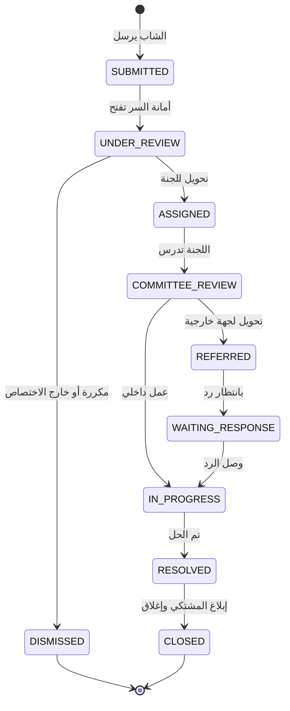
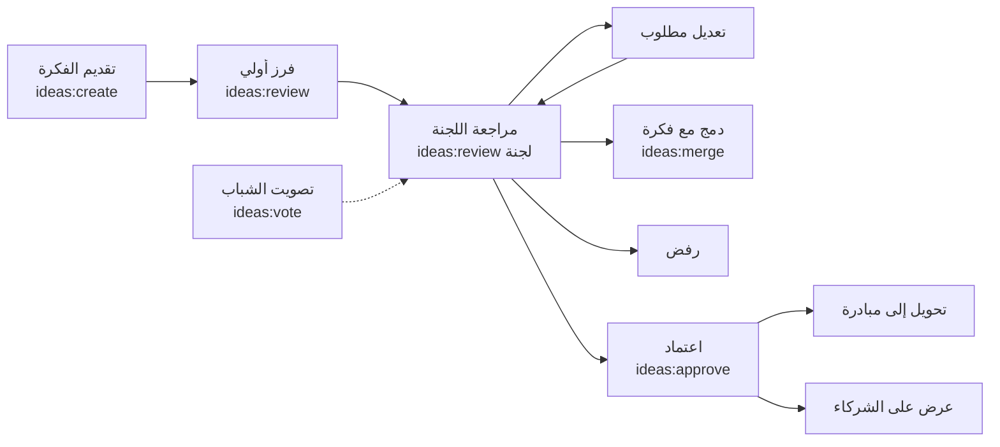
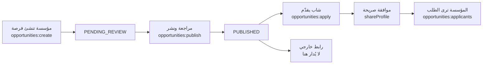
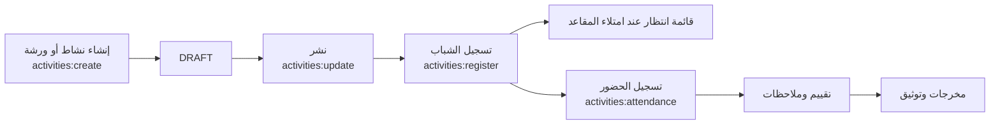
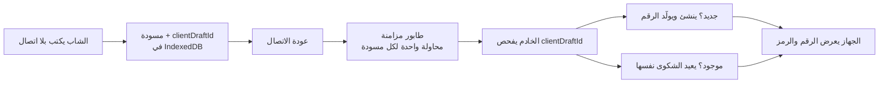
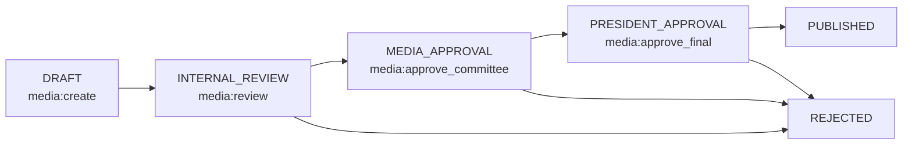
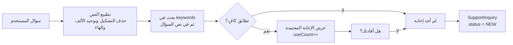

# نبض رفح — PRD & Claude Code Implementation Specification v1.0

| | |
| --- | --- |
| **المشروع** | نبض رفح \| منصة الشباب — Rafah Pulse \| Youth Platform |
| **الجهة** | المجلس البلدي الشبابي — رفح |
| **الإصدار** | 1.1 |
| **التاريخ** | 2026-09-23 |
| **الحالة** | معتمد — Sprint 0 قيد التنفيذ (قرارات 2026-09-23 في §19.3) |
| **يحلّ محل** | «نبض رفح — المعمارية التقنية v1» (يبقى مرجعًا للقرارات، وهذه الوثيقة هي المواصفة التنفيذية) |
| **المرجع البصري** | النموذج التفاعلي «نبض رفح» — شاشاته هي مواصفة الواجهة |

---

## 0. كيف تُستخدم هذه الوثيقة

هذه الوثيقة هي **المرجع الرسمي الوحيد** للتنفيذ. أي سلوك غير موصوف هنا لا يُنفَّذ بالتخمين، بل يُضاف إلى «الأسئلة المفتوحة» ويُسأل عنه.

ترتيب القراءة لمن ينفّذ:

1. `CLAUDE.md` — عقد التنفيذ وقواعد المشروع (يُقرأ تلقائيًا في كل جلسة).
2. القسم الخاص بالسبرنت الحالي في `sprints/sprint-N.md`.
3. الأقسام 3 و 4 و 6 من هذه الوثيقة (الصلاحيات، قاعدة البيانات، الأمن) — تُراجَع قبل كل ميزة.
4. `prisma/schema.prisma` و `prisma/rbac.seed.ts` — مصدر الحقيقة للبيانات والصلاحيات، لا تُعدَّل إلا بتوثيق التغيير هنا.

**قاعدة الأسبقية عند التعارض:** ملفات الكود المرفقة (schema, seed, constraints) ← ثم هذه الوثيقة ← ثم وثيقة المعمارية v1. أي تعارض يُبلَّغ ولا يُحلّ بالاجتهاد.

---

## 1. Product Requirements Document

### 1.1 المشكلة

المجلس البلدي الشبابي في رفح يعمل فعليًا على الأرض: يستقبل شكاوى الشباب، يحوّلها إلى لجانه التسع، يبني مبادرات، ويتواصل مع مؤسسات مانحة. لكن هذا العمل كلّه يجري اليوم عبر قنوات غير منظّمة — مكالمات، مجموعات واتساب، دفاتر ورقية — وينتج عنه أربع مشكلات محدّدة:

1. **الشكوى تضيع.** الشاب يقولها شفويًا فلا تحمل رقمًا ولا مسارًا ولا موعدًا، ولا يعرف أحد أين توقفت ولا من المسؤول عنها.
2. **المجلس بلا ذاكرة مؤسسية.** القرارات والمبادرات والمراسلات موزّعة على أشخاص، فإذا انتهت دورة المجلس أو غاب عضو ضاعت معه المعرفة كاملة.
3. **المؤسسة الداعمة لا ترى احتياجًا مرقّمًا.** الجهات المانحة تستجيب لطلب محدد («مدرّب إلكترونيات لـ30 شابًا، 12 أسبوعًا، 7,400 دولار») لا لرسالة عامة تطلب الدعم، والمجلس لا يملك اليوم أداة تحوّل احتياجه إلى هذا الشكل.
4. **لا يوجد دليل أثر.** المجلس لا يستطيع إثبات ما أنجزه بالأرقام، فيضعف موقفه أمام البلدية والممولين والشباب معًا.

### 1.2 الرؤية

منصة رقمية واحدة تحوّل عمل المجلس الشبابي من جهد فردي متفرّق إلى **نظام تشغيل مؤسسي**: كل صوت شاب يدخل بمسار موثّق، وكل لجنة تعمل على لوحتها، وكل احتياج يصل للمؤسسات مرقّمًا، وكل أثر يُنشر للعامة — ويبقى ذلك كله قائمًا بعد انتهاء دورة المجلس الحالية ودخول الدورة التي تليها.

> صوت الشباب... فكرة تتحول إلى أثر

### 1.3 الأهداف

| # | الهدف | كيف تحققه المنصة |
| --- | --- | --- |
| G1 | ألّا تضيع شكوى واحدة | رقم مرجعي فوري + مسار من تسع مراحل + مسؤول محدد في كل مرحلة + سجل تدقيق |
| G2 | أن يرى الشاب ما حدث لطلبه | صفحة تتبّع عامة برقم الشكوى ورمز سري، وإشعارات عند كل تغيّر حالة |
| G3 | أن يعمل المجلس ولجانه داخل نظام واحد | صندوق وارد، تحويل للجان، لوحة مهام لكل لجنة، اعتماد المنجز |
| G4 | أن يصل الاحتياج للمؤسسات بصيغة قابلة للتمويل | مبادرة ← احتياجات مرقّمة ← عرض دعم ← شراكة موثّقة |
| G5 | أن تُبنى ثقة عامة بالأرقام لا بالتصريحات | صفحة شفافية عامة + تقارير دورية منشورة بلقطة أرقام ثابتة |
| G6 | أن تبقى المنصة بعد الدورة الحالية | دورات مجلس (`CouncilTerm`) وأدوار مؤقتة وبيانات دائمة |
| G7 | أن يجد الشاب إجابة فورية لأسئلته المتكررة | قاعدة FAQ معتمدة من المجلس + بوت يبحث فيها فقط + تحويل ما لا إجابة له لفريق بشري |

### 1.4 المستخدمون

| الفئة | العدد التقريبي في السنة الأولى | الاستخدام الغالب |
| --- | --- | --- |
| شباب رفح | المئات إلى الآلاف | جوّال، اتصال ضعيف ومتقطّع، جلسات قصيرة |
| أعضاء المجلس ولجانه | 40–60 | جوّال أساسًا، وحاسوب عند التقارير |
| مراقبو البلدية | 2 | حاسوب، قراءة وتقارير فقط |
| مؤسسات شريكة | 5–30 | حاسوب، جلسات نادرة وطويلة |
| مدير تقني | 1–2 | حاسوب، إدارة نظام |

**قيد تصميمي مُلزِم:** الجوّال أولًا، والاتصال غير مضمون. كل شاشة يستخدمها الشاب يجب أن تعمل على شاشة 360px وبإنترنت بطيء، ونماذج الشكوى والفكرة تُحفظ محليًا عند الانقطاع.

### 1.5 القيمة لكل طرف

**للشباب:** قناة واحدة معروفة بدل البحث عن «واسطة»: يقدّم شكوى برقم يتابعه بنفسه، يطرح فكرة تُدرس فعلًا، يصوّت على المهارة التي يريد تعلّمها فتتحوّل إلى طلب تدريب حقيقي، ويرى الفرص والمنح والمساعدات في مكان واحد بدل ملاحقة المنشورات. ومن يخشى ذكر اسمه يقدّم شكواه بهوية مخفية ويتابعها برمز سري.

**للمجلس:** ذاكرة مؤسسية لا تعتمد على شخص: صندوق وارد بدل رسائل متفرقة، توزيع مسؤوليات واضح، سجل تدقيق يحمي من الاتهام ويثبت الإنجاز، وتقارير تُبنى من البيانات لا تُكتب من الذاكرة.

**للجان التسع:** لوحة لكل لجنة تريها شكاواها ومبادراتها ومهامها وأعضاءها فقط — بلا ضجيج بقية اللجان، ومع فصل واضح بين من ينفّذ ومن يعتمد.

**للمؤسسات:** رؤية مباشرة لاحتياج مرقّم بدل مراسلات عامة، وإمكانية تقديم ما تملكه فعلًا (مدرّب، مكان، معدات، خبرة) لا التمويل وحده، وسجل شراكة موثّق يسهّل التقرير للجهة الأم.

**للبلدية:** رقابة دون تدخل: مؤشرات ونِسب إغلاق الشكاوى وتقارير قابلة للتصدير، مع حجب بيانات مقدّمي الشكاوى — فتُمارَس الرقابة دون المساس بخصوصية المواطن.

### 1.6 نطاق MVP

| الوحدة | ما يدخل في MVP |
| --- | --- |
| Authentication | تسجيل ودخول ببريد أو هاتف + كلمة مرور، استعادة كلمة المرور، جلسات آمنة |
| Users & Roles | الأدوار العشرة، تعيين وسحب الأدوار، دورات المجلس، تعيين مؤقت (إنابة) |
| Committees | اللجان التسع، لوحة لكل لجنة، مبدّل اللجان، إضافة لجنة جديدة من الإعدادات |
| Youth Profiles | الملف والمهارات وإعدادات الموافقة على المشاركة |
| Complaints | التقديم (باسم أو بهوية مخفية)، الرقم المرجعي، رمز المتابعة، صفحة التتبّع، الفرز، التحويل للجان، المسار الكامل، التحويل الخارجي، المرفقات |
| Ideas | التقديم، التصويت، الفرز، مراجعة اللجنة، الاعتماد، الدمج |
| Initiatives | المبادرات، الاحتياجات المرقّمة، التحديثات، الأثر |
| Organizations | سجل المؤسسات وجهات الاتصال وسجل التواصل (CRM مبسّط) |
| Support / Offers | «ادعمنا»: عرض الاحتياجات، تقديم عرض دعم، قبوله أو رفضه، تحويله إلى شراكة |
| Demand Engine | استطلاع «فرصة عمل... كيف أكون؟» + توليد **مسودة** Concept Note عند بلوغ الحد |
| Opportunities | نشر الفرص (تقديم داخلي أو رابط خارجي)، المراجعة، التقديم بموافقة صريحة |
| Activities | الأنشطة والورش، التسجيل، الحضور، التقييم |
| Tasks | لوحة مهام اللجنة، الإسناد، التنفيذ، الاعتماد، المهمة من شكوى |
| Notifications | داخل المنصة + بريد + زر مشاركة واتساب |
| Reports | تقارير بلقطة أرقام + تصدير |
| Transparency | صفحة عامة بالمؤشرات والتقارير المنشورة |
| Audit Logs | تسجيل كل عملية حساسة، وشاشة عرض السجل |
| FAQ & Support | قاعدة أسئلة معتمدة + بوت بحث فيها + استفسارات بلا إجابة + رد بشري + لوحة إدارة |

### 1.7 خارج نطاق MVP

| المؤجَّل | السبب | الشرط اللازم لإدخاله |
| --- | --- | --- |
| الاجتماعات والمحاضر والقرارات | يديرها المجلس ورقيًا دون خسارة مباشرة للشباب؛ تعتمد على استقرار المهام | استقرار لوحة المهام + طلب المجلس |
| المركز الإعلامي بمسار الموافقات الأربع | يحتاج رؤساء لجان مدرَّبين على النظام أولًا | اكتمال تدريب لجنة الإعلام |
| ساعات التطوع والشهادات | تحتاج بيانات حضور متراكمة من الأنشطة | مرور دورتي أنشطة على الأقل |
| بحث المؤسسات في مهارات الشباب | الأكثر حساسية للخصوصية | إثبات تجربة الموافقة + عدد كافٍ من الملفات |
| WhatsApp Business API و SMS | تكلفة وتوثيق حساب تجاري وتغطية مزوّد غير محسومة | إجابة السؤال Q7 + عقد مزوّد |
| المساعد الذكي (تصنيف/تلخيص/اقتراح) | لا يفيد بلا بيانات حقيقية، ويحتاج مراجعة خصوصية | بيانات ثلاثة أشهر + قرار خصوصية |
| طبقة AI فوق بوت FAQ | الإصدار الأول يعتمد مطابقة كلمات مفتاحية تحت سيطرة المجلس | استقرار قاعدة FAQ |
| الواجهة الإنجليزية | البنية جاهزة من Sprint 0، فالإضافة ترجمة نصوص فقط | طلب المجلس |
| التحليلات المتقدمة | تقارير MVP تغطي مؤشرات الشفافية | بيانات بضعة أشهر |

**قاعدة صارمة:** أي ميزة في هذا الجدول لا تُنفَّذ في MVP إلا إذا ثبت أنها **Dependency تقنية** لميزة داخل النطاق، ويُوثَّق سبب الإدخال في ملف السبرنت.

### 1.8 Success Metrics

الأرقام أدناه **مقترحة** وتُقرّ من المجلس قبل الإطلاق (السؤال Q10)، وكلها قابلة للقياس آليًا من قاعدة البيانات.

| المؤشر | التعريف الدقيق | الهدف المقترح بعد 3 أشهر من الإطلاق |
| --- | --- | --- |
| M1 — تبنّي الشباب | عدد الحسابات الشبابية المفعّلة | 300 حساب |
| M2 — استخدام حقيقي | عدد الشكاوى + الأفكار المقدّمة عبر المنصة | 120 مُدخلًا |
| M3 — سرعة الفرز | وسيط الزمن من `SUBMITTED` إلى `ASSIGNED` | أقل من 48 ساعة |
| M4 — نسبة الإغلاق | الشكاوى في `RESOLVED` أو `CLOSED` ÷ الإجمالي | 60% |
| M5 — متابعة الشاب لنفسه | نسبة الشكاوى التي فُتحت صفحة تتبّعها مرة على الأقل | 70% |
| M6 — تحويل الاحتياج إلى دعم | عدد عروض الدعم المقبولة | 8 عروض |
| M7 — انضباط اللجان | نسبة المهام المغلقة قبل تاريخ استحقاقها | 65% |
| M8 — الشفافية | عدد التقارير المنشورة للعامة | 3 تقارير (شهري × 3) |
| M9 — الاكتفاء الذاتي بالأسئلة | نسبة استفسارات البوت التي وجدت إجابة معتمدة | 60% |
| M10 — نظافة البيانات | عدد سجلات `isDemo = true` في الإنتاج | صفر |


---

## 2. User Personas

اثنتا عشرة شخصية، تُغطّيها **عشرة أدوار** فقط: «المسؤول الإعلامي» و«المسؤول القانوني» ليسا دورين مستقلين بل رئيس/عضو لجنة الإعلام واللجنة القانونية بنطاق «لجنة». هذا مقصود: كل دور جديد يعني مصفوفة صلاحيات جديدة تُصان إلى الأبد.

### P1 — الشاب / المواطن · `youth`

- **الهدف:** يوصل مشكلته أو فكرته لجهة تسمعه، ويعرف ماذا حدث لها، ويجد فرصة أو تدريبًا.
- **الصلاحيات:** `complaints:create` `complaints:read`(خاص) `ideas:create` `ideas:vote` `demand:vote` `opportunities:apply` `activities:register` `profiles:update` `volunteer:log` `support:ask` — كلها بنطاق **خاص**.
- **الشاشات:** `/` · `/track` · `/help` · `/me` · `/me/complaints` · `/me/ideas` · `/me/applications` · `/me/profile` · `/me/notifications`.
- **الإجراءات:** تقديم شكوى (باسمه أو بهوية مخفية) · متابعتها · تقديم فكرة · التصويت · التصويت على مجال تدريب · التقديم على فرصة · التسجيل في نشاط · سؤال البوت.
- **القيود:** لا يرى شكاوى غيره ولا ملاحظات اللجان الداخلية · صوت واحد لكل فكرة ولكل استطلاع · لا تُعرض بياناته لأي مؤسسة إلا بموافقة صريحة منه.

### P2 — رئيس المجلس · `council_president`

- **الهدف:** يرى الصورة الكاملة، ويتخذ الاعتمادات النهائية، ويمثّل المجلس أمام الشركاء والبلدية.
- **الصلاحيات:** 49 صلاحية، أبرزها الحصرية: `ideas:approve` `initiatives:approve` `offers:decide` `concept_notes:approve` `finance:approve` `reports:publish` `media:approve_final` `volunteer:certify`.
- **الشاشات:** `/admin` · `/admin/complaints` · `/admin/initiatives` · `/admin/reports` · `/admin/audit` · `/admin/settings/users`.
- **الإجراءات:** اعتماد فكرة أو مبادرة · قبول عرض دعم · اعتماد قيد مالي · نشر تقرير · تعيين الأدوار · اعتماد مسودة Concept Note قبل إرسالها.
- **القيود:** لا يسجّل قيدًا ماليًا بنفسه (يعتمده فقط) · كل اعتماد يُكتب في سجل التدقيق باسمه.

### P3 — نائب الرئيس · `vice_president`

- **الهدف:** يتابع العمل اليومي ويحوّل ويسدّ مكان الرئيس عند غيابه.
- **الصلاحيات:** 34 صلاحية — كل صلاحيات المتابعة والتحويل والتحديث، **دون** الاعتمادات النهائية.
- **الشاشات:** نفس شاشات الرئيس عدا شاشات الاعتماد النهائي.
- **الإجراءات:** فرز الوارد · تحويل الشكاوى · تحديث المبادرات · اعتماد المهام · قراءة سجل التدقيق.
- **القيود:** لا يعتمد فكرة ولا مبادرة ولا عرض دعم ولا ينشر تقريرًا. **الإنابة** تتم بتعيين مؤقت لدور `council_president` بتاريخ انتهاء — لا بكود خاص للغياب.

### P4 — أمين السر · `secretary`

- **الهدف:** يدير الوارد والمراسلات ويضمن ألا يبقى طلب بلا مسار.
- **الصلاحيات:** 32 صلاحية، أبرزها `complaints:triage` `complaints:refer` `complaints:close` `ideas:review` `organizations:manage` `opportunities:publish` `decisions:create` `faq:manage` `support:respond`.
- **الشاشات:** `/admin/inbox` · `/admin/complaints` · `/admin/ideas` · `/admin/organizations` · `/admin/support`.
- **الإجراءات:** فرز كل وارد جديد · تحويله للجنة المختصة بتعليق وموعد متابعة · نشر الفرص · إدارة قاعدة FAQ.
- **القيود:** لا يعتمد الأفكار ولا المبادرات ولا القيود المالية · لا يقرأ سجل التدقيق.

### P5 — أمين الصندوق · `treasurer`

- **الهدف:** يسجّل الوارد والمصروف ويعرف أين وصل تمويل كل مبادرة.
- **الصلاحيات:** 11 صلاحية فقط: `finance:read` `finance:record` `offers:read` `organizations:read` `reports:read` `reports:export` `meetings:read` `committees:read` ومهامه الخاصة.
- **الشاشات:** `/admin/finance` · `/admin/reports` · `/admin/tasks`.
- **الإجراءات:** تسجيل قيد وارد أو مصروف مرتبط بمبادرة أو مؤسسة · تصدير التقارير المالية.
- **القيود:** **لا يعتمد القيد الذي سجّله** — فصل المهام مفروض بقيد في قاعدة البيانات، لا بالواجهة · لا يرى الشكاوى.

### P6 — رئيس اللجنة · `committee_head`

- **الهدف:** يدير عمل لجنته: شكاواها ومبادراتها ومهام أعضائها.
- **الصلاحيات:** 31 صلاحية بنطاق **لجنة**، أبرزها `tasks:create` `tasks:update` `tasks:approve` `complaints:update_status` `complaints:read_contact` `ideas:review` `initiatives:manage_needs` `volunteer:approve`.
- **الشاشات:** `/admin/committees/[slug]` · `/admin/committees/[slug]/tasks` · `/admin/complaints` (المفلترة على لجنته) · `/admin/initiatives`.
- **الإجراءات:** إسناد مهمة لعضو · اعتماد مهمة منجزة · إنشاء مهمة من شكوى محوّلة إليه · تحديث حالة شكوى لجنته · مراجعة فكرة في مجال لجنته.
- **القيود:** **لا يرى لجنة غير لجنته** · لا يملك أي صلاحية من صلاحيات رئيس المجلس · صلاحيتا مراجعة الإعلام تُفحصان مقابل لجنة الإعلام تحديدًا لا مقابل لجنته.

### P7 — عضو اللجنة · `committee_member`

- **الهدف:** ينفّذ المهام المسندة إليه ويوثّق ما أنجزه.
- **الصلاحيات:** 12 صلاحية فقط: `tasks:read`(لجنة) `tasks:update`(خاص) `tasks:comment` `complaints:read`(لجنة) `ideas:read_internal`(لجنة) `activities:attendance` `initiatives:post_update` `organizations:log`(خاص).
- **الشاشات:** `/admin` · `/admin/tasks` (مهامه) · `/admin/committees/[slug]` (لجنته، للاطلاع).
- **الإجراءات:** بدء مهمته · إرسالها «بانتظار المراجعة» · إضافة ملاحظة متابعة · تسجيل حضور نشاط.
- **القيود:** **لا يعتمد مهمته بنفسه** (قيد في قاعدة البيانات) · لا يحدّث حالة شكوى · لا يرى بيانات التواصل · لا يعدّل مهمة مسندة لزميله.

### P8 — المدير التقني · `super_admin`

- **الهدف:** يبقي النظام يعمل: المستخدمون والأدوار واللجان والإعدادات والنسخ الاحتياطي.
- **الصلاحيات:** 6 فقط: `users:manage_roles` `settings:manage` `committees:manage` `audit:read` `reports:read` `committees:read`.
- **الشاشات:** `/admin/settings/*` · `/admin/audit`.
- **الإجراءات:** إنشاء لجنة · ضبط التصنيفات والمناطق · تعيين الأدوار · مراجعة سجل التدقيق.
- **القيود:** **لا يدير محتوى المجلس:** لا يغيّر حالة شكوى ولا يعتمد شيئًا ولا يقرأ بيانات التواصل المشفّرة. إدارة النظام شيء وقرارات المجلس شيء آخر.

### P9 — مراقب البلدية · `municipality_observer`

- **الهدف:** يراقب أداء المجلس ويأخذ تقارير موثّقة للبلدية.
- **الصلاحيات:** 10 صلاحيات قراءة فقط بنطاق **الكل**.
- **الشاشات:** `/admin` (لوحة مراقبة) · `/admin/complaints` · `/admin/initiatives` · `/admin/reports` · `/transparency`.
- **الإجراءات:** عرض المؤشرات · فتح سجل شكوى لرؤية مسارها · تصدير التقارير.
- **القيود:** **لا يعدّل أي سجل** · لا يرى اسم أو هاتف مقدّم الشكوى · لا يرى سجل التدقيق (يحوي القيم الشخصية قبل التعديل وبعده) · عددهم اثنان بحكم النظام الداخلي.

### P10 — المؤسسة الشريكة · `partner`

- **الهدف:** تجد احتياجًا محددًا تستطيع تغطيته، وتنشر فرصها للشباب.
- **الصلاحيات:** 7 صلاحيات: `offers:create` `offers:read`(خاص) `opportunities:create` `opportunities:applicants`(خاص) `organizations:read`(خاص) `activities:register` `profiles:read_consented`(م٢).
- **الشاشات:** `/support` · `/partner` · `/partner/needs` · `/partner/offers` · `/partner/opportunities`.
- **الإجراءات:** تصفّح المبادرات المحتاجة · تقديم عرض دعم (مالي أو غير مالي) · نشر فرصة · عرض المتقدمين الموافقين.
- **القيود:** لا ترى شكاوى ولا مهام ولا سجل تدقيق · لا ترى ملف شاب إلا بموافقته · فرصها تمرّ بمراجعة قبل النشر.

### P11 — المسؤول الإعلامي (ضمن لجنة الإعلام) · `committee_head`/`committee_member` في لجنة الإعلام

- **الهدف:** يوثّق نشاط المجلس ويضمن ألا يخرج بيان رسمي دون اعتماد.
- **الصلاحيات:** صلاحيات دوره في لجنته + `media:create` `media:review` `media:approve_committee` (م٢) — والموافقة النهائية تبقى لرئيس المجلس.
- **الشاشات:** `/admin/committees/public-relations-media` · `/admin/media` (م٢).
- **الإجراءات:** كتابة مسودة خبر · مراجعتها داخليًا · إعطاء موافقة لجنة الإعلام.
- **القيود:** **لا ينشر بنفسه** · كل خطوة موافقة تُسجَّل باسمه في `MediaReview` وسجل التدقيق.

### P12 — المسؤول القانوني (ضمن اللجنة القانونية) · `committee_head`/`committee_member` في اللجنة القانونية

- **الهدف:** يدرس الشكاوى ذات الطابع القانوني ويوجّهها للجهة الصحيحة.
- **الصلاحيات:** صلاحيات دوره بنطاق لجنته: `complaints:read` `complaints:read_contact` `complaints:refer` `complaints:update_status` `tasks:*`.
- **الشاشات:** `/admin/committees/legal-affairs` · `/admin/complaints` (المفلترة على لجنته).
- **الإجراءات:** دراسة شكوى محوّلة · تحويلها لجهة قانونية خارجية بموعد متابعة · إنشاء مهمة متابعة.
- **القيود:** نفس قيود رئيس/عضو اللجنة · لا يفتح شكوى لم تُحوَّل إلى لجنته.


---

## 3. Role & Permission Specification

### 3.1 النموذج

الصلاحية ليست `if (user.role === 'president')`. هي أربعة عناصر تُقرأ من قاعدة البيانات:

```
Role  +  Resource  +  Action  +  Scope
```

- **Resource:Action** — مفتاح نصي ثابت مثل `complaints:triage`، مُعرَّف مرة واحدة في `Permission`.
- **Scope** — ثلاث قيم فقط:
  - `OWN` — ما أنشأه المستخدم أو أُسند إليه.
  - `COMMITTEE` — سجلات اللجان التي يحمل فيها دورًا **في الدورة الحالية وغير مسحوب**.
  - `ALL` — كل السجلات.

الدالة الوحيدة المسموح بها للفحص:

```ts
can(user, 'complaints:update_status', { committeeId, ownerId }): boolean
```

قواعد مُلزِمة:

1. لا يوجد في الكود أي مقارنة باسم دور أو باسم مستخدم. أي `role === '...'` مرفوض في المراجعة.
2. كل Server Action وكل صفحة تقرأ بيانات محمية تستدعي `can()` **على الخادم** قبل أي قراءة أو كتابة.
3. `PermissionGate` في الواجهة لإخفاء الأزرار فقط — إخفاء الزر ليس حماية.
4. الصلاحيات تُحمَّل من `prisma/rbac.seed.ts` عبر `seedRbac()`، وهو **نفس المصدر** الذي وُلّدت منه المصفوفة أدناه.
5. إضافة صلاحية جديدة = تعديل `rbac.seed.ts` + تحديث هذه الوثيقة + migration للـ seed. ثلاثتها معًا أو لا شيء.

### 3.2 آلية النطاق COMMITTEE

```
عضويات المستخدم = RoleAssignment
  حيث userId = المستخدم
    و revokedAt IS NULL
    و (endsAt IS NULL أو endsAt > الآن)
    و term.isCurrent = true
→ مجموعة committeeId
```

الصلاحية بنطاق `COMMITTEE` تُمنح إذا كان `committeeId` الخاص بالسجل هو لجنة **التعيين الذي حمل تلك المنحة تحديدًا** (قرار D16 — أقل الصلاحيات): من يرأس لجنة (أ) وهو عضو في لجنة (ب) يعتمد مهام (أ) فقط، ويقرأ مهام اللجنتين. لا يوجد جدول `CommitteeMember` منفصل: عضوية اللجنة **هي** تعيين دور مقيّد بلجنة، فلا يمكن أن تتعارض العضوية مع الصلاحية.

### 3.3 المصفوفة النهائية

هذه المصفوفة مولَّدة آليًا من `prisma/rbac.seed.ts` — قابلة للتحويل المباشر إلى Seed Data دون إعادة كتابة: **10 أدوار × 69 صلاحية = 202 منحة**.

| الصلاحية | مدير تقني | رئيس | نائب | أمين سر | صندوق | ر. لجنة | ع. لجنة | بلدية | مؤسسة | شاب |
| --- | --- | --- | --- | --- | --- | --- | --- | --- | --- | --- |
| `complaints:create` تقديم شكوى | — | — | — | — | — | — | — | — | — | خاص |
| `complaints:read` عرض الشكاوى وتفاصيلها (بلا بيانات التواصل) | — | الكل | الكل | الكل | — | لجنة | لجنة | الكل | — | خاص |
| `complaints:read_contact` عرض بيانات التواصل المشفّرة لمقدّم الشكوى | — | الكل | الكل | الكل | — | لجنة | — | — | — | — |
| `complaints:triage` فرز الوارد وتحويله إلى لجنة | — | الكل | الكل | الكل | — | — | — | — | — | — |
| `complaints:update_status` تحديث حالة الشكوى في مسارها | — | الكل | الكل | الكل | — | لجنة | — | — | — | — |
| `complaints:refer` تحويل لجهة خارجية (بلدية، مؤسسة…) | — | الكل | الكل | الكل | — | لجنة | — | — | — | — |
| `complaints:close` إغلاق الشكوى أو استبعادها بسبب مكتوب | — | الكل | الكل | الكل | — | لجنة | — | — | — | — |
| `complaints:export` تصدير سجل الشكاوى | — | الكل | الكل | الكل | — | — | — | — | — | — |
| `ideas:create` تقديم فكرة | — | — | — | — | — | — | — | — | — | خاص |
| `ideas:vote` التصويت على فكرة | — | — | — | — | — | — | — | — | — | خاص |
| `ideas:read_internal` عرض ملاحظات المراجعة الداخلية | — | الكل | الكل | الكل | — | لجنة | لجنة | الكل | — | — |
| `ideas:review` فرز الفكرة وإحالتها وطلب تعديلها | — | الكل | الكل | الكل | — | لجنة | — | — | — | — |
| `ideas:approve` اعتماد الفكرة أو رفضها نهائيًا | — | الكل | — | — | — | — | — | — | — | — |
| `ideas:merge` دمج فكرتين متشابهتين | — | الكل | الكل | الكل | — | — | — | — | — | — |
| `demand:vote` التصويت على مجالات التدريب | — | — | — | — | — | — | — | — | — | خاص |
| `demand:manage` إنشاء استطلاع طلب وتحديد حدّ المقترح | — | الكل | الكل | الكل | — | — | — | — | — | — |
| `concept_notes:approve` اعتماد مسودة Concept Note قبل إرسالها | — | الكل | — | — | — | — | — | — | — | — |
| `initiatives:create` إنشاء مبادرة | — | الكل | — | — | — | لجنة | — | — | — | — |
| `initiatives:update` تعديل المبادرة ونسبة الإنجاز | — | الكل | الكل | — | — | لجنة | — | — | — | — |
| `initiatives:manage_needs` إدارة الاحتياجات المرقّمة | — | الكل | الكل | — | — | لجنة | — | — | — | — |
| `initiatives:approve` اعتماد المبادرة ونشرها للعامة | — | الكل | — | — | — | — | — | — | — | — |
| `initiatives:post_update` نشر تحديث ميداني عن المبادرة | — | الكل | الكل | — | — | لجنة | لجنة | — | — | — |
| `offers:create` تقديم عرض دعم | — | — | — | — | — | — | — | — | خاص | — |
| `offers:read` عرض عروض الدعم | — | الكل | الكل | الكل | الكل | لجنة | — | الكل | خاص | — |
| `offers:decide` قبول عرض الدعم أو رفضه | — | الكل | — | — | — | — | — | — | — | — |
| `organizations:read` عرض سجل المؤسسات | — | الكل | الكل | الكل | الكل | الكل | الكل | الكل | خاص | — |
| `organizations:manage` إضافة مؤسسة وتعديل مرحلة الشراكة | — | الكل | الكل | الكل | — | — | — | — | — | — |
| `organizations:log` تسجيل تواصل أو اجتماع مع مؤسسة | — | خاص | خاص | خاص | — | خاص | خاص | — | — | — |
| `opportunities:create` نشر فرصة (تدخل المراجعة) | — | — | — | — | — | — | — | — | خاص | — |
| `opportunities:publish` اعتماد الفرصة ونشرها | — | الكل | الكل | الكل | — | — | — | — | — | — |
| `opportunities:apply` التقديم على فرصة | — | — | — | — | — | — | — | — | — | خاص |
| `opportunities:applicants` عرض المتقدمين (بموافقتهم فقط) | — | الكل | — | — | — | — | — | — | خاص | — |
| `activities:create` إنشاء نشاط أو ورشة | — | الكل | — | الكل | — | لجنة | — | — | — | — |
| `activities:update` تعديل النشاط ونشره | — | الكل | — | الكل | — | لجنة | — | — | — | — |
| `activities:register` التسجيل في نشاط وتقييمه | — | — | — | — | — | — | — | — | خاص | خاص |
| `activities:attendance` تسجيل الحضور | — | — | — | — | — | لجنة | لجنة | — | — | — |
| `tasks:read` عرض المهام | — | الكل | الكل | الكل | خاص | لجنة | لجنة | الكل | — | — |
| `tasks:create` إنشاء مهمة وإسنادها | — | الكل | الكل | الكل | — | لجنة | — | — | — | — |
| `tasks:update` تحديث حالة المهمة حتى «مراجعة» | — | الكل | الكل | الكل | خاص | لجنة | خاص | — | — | — |
| `tasks:approve` اعتماد المهمة المنجزة وإغلاقها | — | الكل | الكل | — | — | لجنة | — | — | — | — |
| `tasks:comment` إضافة ملاحظة متابعة | — | الكل | الكل | الكل | خاص | لجنة | لجنة | — | — | — |
| `committees:read` عرض لوحة اللجنة وأعضائها | الكل | الكل | الكل | الكل | الكل | لجنة | لجنة | الكل | — | — |
| `committees:manage` إنشاء لجنة وتعديل مجالها | الكل | — | — | — | — | — | — | — | — | — |
| `finance:read` عرض السجل المالي | — | الكل | الكل | — | الكل | — | — | الكل | — | — |
| `finance:record` تسجيل تمويل وارد أو مصروف | — | — | — | — | الكل | — | — | — | — | — |
| `finance:approve` اعتماد القيد المالي | — | الكل | — | — | — | — | — | — | — | — |
| `profiles:update` تعديل الملف الشخصي والمهارات والموافقات | — | — | — | — | — | — | — | — | — | خاص |
| `profiles:read_consented` البحث في ملفات الشباب الموافقين على المشاركة (م٢) | — | — | — | — | — | — | — | — | الكل | — |
| `reports:read` عرض التقارير والمؤشرات الداخلية | الكل | الكل | الكل | الكل | الكل | الكل | — | الكل | — | — |
| `reports:export` تصدير التقارير | — | الكل | الكل | الكل | الكل | — | — | الكل | — | — |
| `reports:publish` نشر تقرير في صفحة الشفافية | — | الكل | — | — | — | — | — | — | — | — |
| `audit:read` عرض سجل التدقيق | الكل | الكل | الكل | — | — | — | — | — | — | — |
| `users:manage_roles` تعيين الأدوار وسحبها وإدارة الدورات | الكل | الكل | — | — | — | — | — | — | — | — |
| `settings:manage` التصنيفات والمناطق وإعدادات النظام | الكل | — | — | — | — | — | — | — | — | — |
| `meetings:read` عرض الاجتماعات والمحاضر (م٢) | — | الكل | الكل | الكل | الكل | لجنة | لجنة | الكل | — | — |
| `meetings:manage` جدولة الاجتماع وتسجيل الحضور والمحضر (م٢) | — | الكل | الكل | الكل | — | لجنة | — | — | — | — |
| `decisions:create` إصدار قرار مرقّم (م٢) | — | الكل | — | الكل | — | — | — | — | — | — |
| `media:create` كتابة مسودة خبر أو بيان (م٢) | — | — | — | — | — | لجنة | لجنة | — | — | — |
| `media:review` المراجعة الداخلية (م٢) | — | — | — | — | — | لجنة | — | — | — | — |
| `media:approve_committee` موافقة لجنة الإعلام (م٢) | — | — | — | — | — | لجنة | — | — | — | — |
| `media:approve_final` الموافقة النهائية والنشر (م٢) | — | الكل | — | — | — | — | — | — | — | — |
| `volunteer:log` تسجيل ساعات تطوع (م٢) | — | — | — | — | — | — | — | — | — | خاص |
| `volunteer:approve` اعتماد ساعات التطوع (م٢) | — | — | — | — | — | لجنة | — | — | — | — |
| `volunteer:certify` إصدار شهادة (م٢) | — | الكل | — | — | — | — | — | — | — | — |
| `ai:use` طلب اقتراح من المساعد الذكي وقبوله (م٢) | — | الكل | الكل | الكل | — | لجنة | — | — | — | — |
| `support:ask` إرسال استفسار للبوت أو لفريق المجلس | — | — | — | — | — | — | — | — | — | خاص |
| `support:read` عرض الاستفسارات الواردة ولوحة الدعم | — | الكل | الكل | الكل | — | — | — | — | — | — |
| `support:respond` الرد على استفسار وإسناده وإغلاقه | — | الكل | الكل | الكل | — | — | — | — | — | — |
| `faq:manage` إنشاء وتعديل وتعطيل أسئلة FAQ المعتمدة | — | الكل | — | الكل | — | — | — | — | — | — |

> **قراءة الخلية:** «الكل» = كل السجلات · «لجنة» = سجلات لجانه في الدورة الحالية · «خاص» = ما أنشأه أو أُسند إليه · «—» = ممنوع تمامًا، ولا يُعرض له الزر أصلًا.

### 3.4 قواعد ثابتة في التوزيع

| القاعدة | التطبيق |
| --- | --- |
| المدير التقني لا يدير المحتوى | 6 صلاحيات إدارة نظام فقط، بلا اعتماد وبلا بيانات تواصل |
| فصل المهام المالية | `finance:record` لأمين الصندوق و `finance:approve` للرئيس، مع قيد `funding_four_eyes` في قاعدة البيانات |
| لا اعتماد ذاتي للمهام | `tasks:approve` للرئيس والنائب بنطاق الكل، ولرئيس اللجنة بنطاق لجنته — ولا يملكها عضو اللجنة، مع قيد `tasks_no_self_approval` |
| الإنابة بالتعيين لا بالكود | دور الرئيس يُمنح للنائب بتعيين له `endsAt` |
| البلدية بلا بيانات شخصية | لا `complaints:read_contact` ولا `audit:read` |
| موافقة الشاب شرط لرؤية ملفه | `opportunities:applicants` يقرأ فقط الطلبات التي `shareProfile = true` |
| الرد على الاستفسارات قابل للتوسيع | إن أراد المجلس أن يردّ المسؤول الإعلامي، يُنشئ المدير التقني دورًا جديدًا (`support_officer`) بصلاحيتي `support:read` و `support:respond` من الإعدادات — بلا تعديل كود (السؤال Q9) |


---

## 4. Database Specification

**المصدر الرسمي:** `prisma/schema.prisma` — 59 نموذجًا و 41 enum، مكتوب لـ **Prisma 7.10**، تحقّق منه المدقّق الرسمي ووُلّد منه Prisma Client بنجاح. هذا القسم شرح وليس بديلًا: عند أي اختلاف، الملف هو الحقيقة.

### 4.1 قواعد عامة على كل النماذج

| القاعدة | التطبيق |
| --- | --- |
| المعرّف | `String @id @default(uuid()) @db.Uuid` — عدا `AuditLog` (`BigInt` تسلسلي للترتيب) و `Counter` (مفتاح نصي) |
| الطوابع | `createdAt` و `updatedAt` على كل نموذج قابل للتعديل |
| الحذف الناعم | `deletedAt` على 12 نموذجًا: User · Committee · Organization · FaqEntry · Complaint · Idea · Initiative · Opportunity · Activity · Task · MediaPost · FileObject — يُطبَّق عبر Prisma Client Extension (`$extends`) لا عبر middleware المتروك |
| أسماء الجداول | `@@map` بصيغة snake_case؛ أسماء الحقول camelCase كما هي |
| المال | `Decimal @db.Decimal(12,2)` — لا `Float` إطلاقًا · العملة `currency` بقيمة `ILS` افتراضيًا، و `USD` مسموحة للتمويل الخارجي |
| البيانات التجريبية | `isDemo` على 6 نماذج (Complaint, Idea, Initiative, Organization, Opportunity, Activity) — تُحذف كلها قبل الإطلاق |
| التدقيق | كل عملية في جدول «العمليات الحساسة» (§6.9) تكتب سطرًا في `AuditLog` **داخل نفس المعاملة** |

### 4.2 الهوية والصلاحيات والدورات

| Model | الغرض | حقول مفتاحية | قيود وفهارس |
| --- | --- | --- | --- |
| `User` | المستخدم. الهوية والجلسات في Supabase Auth؛ هذا الجدول يربطها بالتطبيق | `authId` `email` `phone` `fullName` `locale` `isActive` | `authId` و `email` و `phone` فريدة · فهرس على `deletedAt` |
| `Role` | الدور كسجل بيانات لا كقيمة في الكود | `key` `nameAr` `requiresCommittee` `isTermBound` `isSystem` | `key` فريد |
| `Permission` | الصلاحية الذرّية `resource:action` | `key` `resource` `action` | `key` فريد · `[resource, action]` فريد |
| `RolePermission` | ربط الدور بالصلاحية **مع النطاق** | `scope` | مفتاح مركّب `[roleId, permissionId]` |
| `CouncilTerm` | دورة المجلس — مفتاح الاستدامة | `name` `startsAt` `endsAt` `isCurrent` | فهرس فريد جزئي: دورة حالية واحدة فقط |
| `RoleAssignment` | **المصدر الوحيد** لمن يحمل أي دور في أي لجنة وأي دورة | `userId` `roleId` `termId` `committeeId` `title` `endsAt` `revokedAt` | فهارس على `[userId, revokedAt]` و `[committeeId, roleId]` |

### 4.3 اللجان والجداول المرجعية

| Model | الغرض | حقول مفتاحية | قيود وفهارس |
| --- | --- | --- | --- |
| `Committee` | اللجنة كسجل بيانات — تُضاف لجنة عاشرة من الإعدادات بلا كود | `slug` `nameAr` `mandate` `isActive` `sortOrder` | `slug` فريد · حذف ناعم |

**اللجان التسع (بذرة `prisma/seed.ts`):**

| # | اللجنة | `slug` |
| --- | --- | --- |
| 1 | لجنة التكنولوجيا والأنظمة الرقمية | `technology-digital-systems` |
| 2 | لجنة الأنشطة والمبادرات | `activities-initiatives` |
| 3 | لجنة المؤسسات والشراكات | `organizations-partnerships` |
| 4 | لجنة المرأة | `women-empowerment` |
| 5 | اللجنة القانونية | `legal-affairs` |
| 6 | اللجنة الرياضية والفنية | `sports-arts` |
| 7 | لجنة العلاقات العامة والإعلام | `public-relations-media` |
| 8 | اللجنة الصحية | `health-affairs` |
| 9 | لجنة الدعم اللوجستي | `logistical-support` |

«لجنة الإعلام» في §2 و §9 هي `public-relations-media`. تُحدَّد في الكود بإعداد نظام (slug)، لا بمقارنة اسم.
| `Area` | المنطقة/الحي بشجرة — لتعمل إحصاءات «أكثر القضايا حسب المنطقة» | `nameAr` `parentId` | `nameAr` فريد · علاقة ذاتية |
| `ComplaintCategory` | تصنيف الشكوى مع اللجنة الافتراضية المقترحة | `nameAr` `defaultCommitteeId` | `nameAr` فريد |
| `Counter` | عدّاد الأرقام المرجعية لكل نوع وسنة | `key` `value` | مفتاح نصي (`CMP-2026`) · تُقرأ عبر دالة `next_ref(key, width)` التي تضيف البادئة `RF-` |

**الأرقام المرجعية:**

| النوع | الاستدعاء | الناتج |
| --- | --- | --- |
| شكوى | `next_ref('CMP-2026')` | `RF-CMP-2026-000124` |
| فكرة | `next_ref('IDA-2026')` | `RF-IDA-2026-000031` |
| قرار (م٢) | `next_ref('DEC-2026', 4)` | `RF-DEC-2026-0012` |
| `Skill` | المهارة كمرجع موحّد | `nameAr` `category` | `nameAr` فريد |

### 4.4 الشباب

| Model | الغرض | حقول مفتاحية | قيود وفهارس |
| --- | --- | --- | --- |
| `YouthProfile` | ملف الشاب — بلا تاريخ ميلاد كامل ولا رقم هوية | `birthYear` `areaId` `educationLevel` `languages[]` `interests[]` `jobSeeking` `shareWithPartners` `consentUpdatedAt` | علاقة 1:1 مع `User` (المفتاح هو `userId`) |
| `YouthSkill` | مهارات الشاب ومستواها | `level` | مفتاح مركّب `[userId, skillId]` |

**تقليل البيانات:** لا يُخزَّن رقم الهوية ولا العنوان التفصيلي ولا تاريخ الميلاد الكامل. سنة الميلاد تكفي للفئة العمرية، والمنطقة تكفي للإحصاء الجغرافي.

### 4.5 الشكاوى

| Model | الغرض | حقول مفتاحية | قيود وفهارس |
| --- | --- | --- | --- |
| `Complaint` | الشكوى | `reference` `accessCodeHash` `clientDraftId` `status` `isAnonymous` `submitterId` `committeeId` `assigneeId` `dismissReason` `followUpAt` (D23) | `reference` و `clientDraftId` فريدان · فهارس `[status, committeeId]` و `[categoryId, areaId]` · قيدان: المجهولة بلا `submitterId`، والمستبعَدة بسبب مكتوب |
| `ComplaintContact` | الاسم والهاتف والبريد **مشفّرة** (`Bytes`) في جدول منفصل | `nameEnc` `phoneEnc` `emailEnc` `preferredChannel` | 1:1 مع الشكوى · تُقرأ بصلاحية `complaints:read_contact` فقط |
| `ComplaintEvent` | كل انتقال في المسار، مع `isPublic` يفصل ما يراه المواطن عن الملاحظات الداخلية | `fromStatus` `toStatus` `note` `isPublic` `actorId` | فهرس `[complaintId, createdAt]` |
| `ComplaintReferral` | التحويل لجهة خارجية بموعد متابعة ورد | `target` `targetName` `followUpAt` `respondedAt` `response` | فهرس على `followUpAt` لتنبيهات المتابعة |

### 4.6 الأفكار ومحرك الطلب

| Model | الغرض | حقول مفتاحية | قيود وفهارس |
| --- | --- | --- | --- |
| `Idea` | الفكرة بمشكلتها وحلّها وكلفتها | `reference` `status` `voteCount` `mergedIntoId` `initiativeId` `clientDraftId` | `reference` فريد · فهرس على `voteCount` · علاقة دمج ذاتية |
| `IdeaVote` | صوت واحد لكل حساب لكل فكرة | — | مفتاح مركّب `[ideaId, userId]` — يمنع التصويت المكرر على مستوى قاعدة البيانات |
| `DemandPoll` | استطلاع «فرصة عمل... كيف أكون؟» | `proposalThreshold` `isActive` `closesAt` | مرتبط اختياريًا بمبادرة |
| `DemandOption` | مجال تدريب قابل للتصويت | `label` `skillId` `voteCount` | — |
| `DemandVote` | صوت واحد لكل حساب لكل استطلاع، قابل للتغيير | `optionId` `updatedAt` | مفتاح مركّب `[pollId, userId]` |
| `ConceptNote` | مقترح مشروع يولّده النظام **كمسودة** | `status` `bodyMd` `generatedBy` `reviewedById` `approvedAt` `sentAt` | يبدأ `DRAFT` دائمًا · `fileId` فريد |

### 4.7 المبادرات والدعم والتمويل

| Model | الغرض | حقول مفتاحية | قيود وفهارس |
| --- | --- | --- | --- |
| `Initiative` | المبادرة | `slug` `status` `estimatedBudget` `beneficiariesTarget` `progressPct` `isFlagship` `isDemo` | `slug` فريد · قيد `progressPct` بين 0 و 100 |
| `InitiativeNeed` | الاحتياج المرقّم — ما تراه المؤسسة وتختار منه | `type` `description` `quantity` `unit` `amount` `status` | فهرس `[initiativeId, status]` |
| `SupportOffer` | عرض دعم (مالي أو غير مالي) مرتبط باحتياج | `types[]` `amount` `status` `decidedById` `decisionNote` | فهرس `[initiativeId, status]` |
| `InitiativePartner` | المؤسسة الشريكة في المبادرة ودورها | `role` `since` | مفتاح مركّب `[initiativeId, organizationId]` |
| `InitiativeUpdate` | تحديث ميداني، عام أو داخلي | `body` `isPublic` | فهرس `[initiativeId, createdAt]` |
| `FundingRecord` | القيد المالي — **المبلغ المؤمَّن مشتق من مجموع الوارد المعتمد** لا رقم يُكتب يدويًا | `direction` `amount` `recordedById` `approvedById` `approvedAt` | قيدان: المبلغ موجب، والمعتمِد ≠ المسجِّل |

### 4.8 المؤسسات — CRM

| Model | الغرض | حقول مفتاحية | قيود وفهارس |
| --- | --- | --- | --- |
| `Organization` | المؤسسة ومرحلة شراكتها | `type` `country` `sectors[]` `stage` `ownerId` `lastContactAt` | فهرس `[type, stage]` · حذف ناعم |
| `OrgContact` | جهة الاتصال داخل المؤسسة | `fullName` `jobTitle` `isPrimary` | فهرس على المؤسسة |
| `Interaction` | سجل التواصل: اتصال، اجتماع، إرسال مقترح… | `type` `summary` `occurredAt` `followUpAt` | فهرسان على `[organizationId, occurredAt]` و `followUpAt` |
| `PartnerMembership` | أي مستخدم يمثّل أي مؤسسة | `isAdmin` | مفتاح مركّب `[userId, organizationId]` |
| `Agreement` | الاتفاقية الموقّعة ومرفقها | `title` `signedAt` `startsAt` `endsAt` | `fileId` فريد |

### 4.9 الفرص والأنشطة والتطوع

| Model | الغرض | حقول مفتاحية | قيود وفهارس |
| --- | --- | --- | --- |
| `Opportunity` | الفرصة: وظيفة، تدريب، منحة، مساعدة… | `type` `applyMode` `externalUrl` `seats` `deadline` `status` `publishedAt` | فهرسان `[status, type]` و `deadline` |
| `OpportunitySkill` | مهارات الفرصة | — | مفتاح مركّب |
| `OpportunityApplication` | الطلب **مع موافقة صريحة** على مشاركة الملف | `message` `shareProfile` `status` | `[opportunityId, applicantId]` فريد — طلب واحد لكل شاب |
| `Activity` | النشاط أو الورشة (`kind = WORKSHOP`) | `kind` `startsAt` `seats` `registrationOpen` `status` `outcomes` | فهرسان `[startsAt, status]` و `committeeId` |
| `ActivityRegistration` | التسجيل والحضور والتقييم | `status` `isVolunteer` `rating` `feedback` | `[activityId, userId]` فريد · قيد التقييم 1–5 |
| `ActivityPartner` | مؤسسة شريكة في النشاط | — | مفتاح مركّب |
| `VolunteerHour` | ساعة تطوع **لا تُحتسب قبل اعتمادها** | `hours` `date` `status` `approvedById` | قيد: أكبر من صفر و ≤ 24 |
| `Certificate` | شهادة برمز تحقق عام | `serial` `verifyCode` `kind` `hours` `revokedAt` | `serial` و `verifyCode` فريدان |

### 4.10 عمل المجلس والإعلام

| Model | الغرض | حقول مفتاحية | قيود وفهارس |
| --- | --- | --- | --- |
| `Meeting` | الاجتماع ومحضره | `number` `termId` `committeeId` `status` `minutesMd` | `[termId, committeeId, number]` فريد |
| `AgendaItem` | بند جدول الأعمال، قد يرتبط بشكوى أو مبادرة | `order` `title` | فهرس `[meetingId, order]` |
| `MeetingAttendance` | الحضور والغياب والاعتذار | `status` | مفتاح مركّب |
| `Decision` | القرار المرقّم | `reference` `text` `decidedAt` | `reference` فريد (`RF-DEC-2026-0012`) |
| `Task` | المهمة — قد تنشأ من شكوى أو مبادرة أو قرار | `status` `priority` `dueAt` `assigneeId` `approvedById` `complaintId` `initiativeId` `decisionId` | فهارس `[committeeId, status]` و `[assigneeId, status]` و `dueAt` · قيد منع الاعتماد الذاتي |
| `TaskComment` | ملاحظة متابعة على المهمة | `body` | فهرس `[taskId, createdAt]` |
| `MediaPost` | الخبر أو البيان ومساره | `slug` `type` `status` `publishedById` `publishedAt` | `slug` فريد · فهرس `[status, type]` |
| `MediaReview` | كل خطوة موافقة: من راجع، في أي مرحلة، بأي قرار | `stage` `decision` `comment` | فهرس `[postId, createdAt]` |

### 4.11 النظام

| Model | الغرض | حقول مفتاحية | قيود وفهارس |
| --- | --- | --- | --- |
| `FileObject` | الملف المرفوع — مالك واحد على الأكثر | `bucket` `path` `mimeType` `sizeBytes` `sha256` `isPublic` `scan` | `path` فريد · قيد `files_single_owner` |
| `Notification` | إشعار بقناته وحالته | `type` `title` `link` `channel` `status` `readAt` | فهرسان `[userId, readAt]` و `[status, channel]` |
| `NotificationPreference` | تفضيل المستخدم لكل نوع وقناة | `enabled` | مفتاح مركّب ثلاثي |
| `Report` | التقرير **بلقطة أرقامه** وقت النشر | `period` `periodStart` `periodEnd` `metrics (Json)` `isPublished` | فهرس `[isPublished, periodEnd]` |
| `AuditLog` | سجل إلحاقي فقط | `actorId` `actorRoles[]` `action` `entityType` `entityId` `before` `after` `ip` | `BigInt` تسلسلي · ثلاثة فهارس · **trigger يمنع التعديل والحذف** |
| `AiSuggestion` | اقتراح الذكاء الاصطناعي — لا يُطبَّق دون قرار إنسان | `kind` `payload` `model` `status` `decidedById` | فهرس `[entityType, entityId]` |

### 4.12 FAQ وبوت الاستفسارات

| Model | الغرض | حقول مفتاحية | قيود وفهارس |
| --- | --- | --- | --- |
| `FaqCategory` | تصنيف الأسئلة (شكاوى، أفكار، تطوع…) | `nameAr` `slug` `sortOrder` `isActive` | `nameAr` و `slug` فريدان |
| `FaqEntry` | سؤال وجواب **معتمد من المجلس** | `question` `answerMd` `keywords[]` `isActive` `useCount` | فهرس `[isActive, categoryId]` · حذف ناعم |
| `SupportInquiry` | استفسار لم يجد له البوت إجابة، أو أُرسل مباشرة | `question` `askerId` `contactHint` `status` `matchedFaqId` `assigneeId` `answerMd` `answeredById` `promotedToFaq` | فهرسان `[status, createdAt]` و `assigneeId` |

### 4.13 القيود خارج Prisma

ملف `sql/constraints.sql` (15 تعليمة، مختبَرة على PostgreSQL) يُلصق داخل أول migration يدوية. يحتوي:

| القيد | ما يمنعه |
| --- | --- |
| `next_ref()` | رقمين مرجعيين متطابقين عند تقديم شكويين في نفس اللحظة |
| trigger على `audit_logs` | تعديل أو حذف سطر من سجل التدقيق — حتى من قاعدة البيانات |
| `complaints_anonymous_has_no_submitter` | ربط شكوى مجهولة بحساب صاحبها |
| `complaints_dismissed_needs_reason` | استبعاد شكوى بلا سبب مكتوب |
| `files_single_owner` | ملف واحد يتبع سجلّين |
| `funding_four_eyes` | اعتماد الشخص لقيده المالي |
| `tasks_no_self_approval` | اعتماد العضو لمهمته |
| `council_terms_one_current` | وجود دورتَي مجلس حاليتين |
| `meetings_termId_committeeId_number_key` (`NULLS NOT DISTINCT`) | تكرار رقم اجتماع المجلس العام (بلا لجنة) في نفس الدورة |
| قيود النطاق | تقييم خارج 1–5، نسبة إنجاز خارج 0–100، ساعات تطوع سالبة أو فوق 24، مبلغ سالب |


---

## 5. User Flows

### 5.1 مسار الشكوى — Complaint Flow



| الخطوة | من ينفّذها | الصلاحية | ما يحدث في النظام |
| --- | --- | --- | --- |
| 1. التقديم | الشاب (`/me/complaints/new`) أو زائر (`/complaints/public-new`) | `complaints:create` للشاب · الزائر بلا حساب: حد معدل مشدّد و `submitterId = NULL` دائمًا | إنشاء `Complaint` + `ComplaintContact` مشفّر + أول `ComplaintEvent` |
| 2. توليد الرقم | النظام | — | `next_ref('CMP-2026')` داخل المعاملة → `RF-CMP-2026-000124` |
| 3. توليد رمز المتابعة | النظام | — | رمز عشوائي 8 خانات يُعرض **مرة واحدة**، ويُخزَّن `accessCodeHash` فقط |
| 4. حفظ بيانات التواصل | النظام | — | تشفير AES-256-GCM بمفتاح خارج قاعدة البيانات |
| 5. الفرز | أمين السر / النائب / الرئيس | `complaints:triage` | `UNDER_REVIEW` ثم اختيار اللجنة (التصنيف يقترح لجنة افتراضية) |
| 6. التحويل للجنة | نفسهم | `complaints:triage` | `committeeId` + `ASSIGNED` + حدث عام + إشعار لرئيس اللجنة |
| 7. دراسة اللجنة | رئيس اللجنة | `complaints:update_status`(لجنة) | `COMMITTEE_REVIEW` · يجوز إنشاء `Task` مرتبطة بالشكوى |
| 8. التحويل الخارجي | رئيس اللجنة / أمين السر | `complaints:refer` | `ComplaintReferral` + `REFERRED` + موعد متابعة |
| 9. التحديثات | رئيس اللجنة | `complaints:update_status` | `IN_PROGRESS` ↔ `WAITING_RESPONSE` مع ملاحظات (عامة أو داخلية) |
| 10. الحل | رئيس اللجنة | `complaints:update_status` | `RESOLVED` + `resolutionNote` + إشعار للمشتكي |
| 11. الإغلاق | أمين السر / الرئيس | `complaints:close` | `CLOSED` + `closedAt` |
| 12. الاستبعاد | أمين السر | `complaints:close` | `DISMISSED` + `dismissReason` **إلزامي** (قيد قاعدة بيانات) |

**التتبّع:** في أي لحظة، `/track` بالرقم + الرمز السري يعرض **فقط** الأحداث التي `isPublic = true`، وحالة الشكوى واللجنة المسؤولة. لا يعرض أبدًا: بيانات التواصل، الملاحظات الداخلية، أسماء المنفّذين، ولا أي شكوى أخرى.

### 5.2 مسار الفكرة — Idea Flow



التصويت خط متقطّع في الرسم لأنه **مؤشر أولوية لا بوابة**: الفكرة تمرّ إلى المراجعة بغض النظر عن عدد أصواتها، والاعتماد قرار اللجنة والرئيس بناءً على الجدوى والموارد. عند الاعتماد يجوز تحويلها إلى `Initiative` (يُملأ `Idea.initiativeId`) أو إلى `ConceptNote` مسودة.

### 5.3 مسار المبادرة — Initiative Flow

```mermaid
flowchart LR
  A["فكرة معتمدة"] --> B["مبادرة<br/>initiatives:create"]
  B --> C["احتياجات مرقّمة<br/>initiatives:manage_needs"]
  C --> D["عرض عام في ادعمنا"]
  D --> E["عرض دعم من مؤسسة<br/>offers:create"]
  E --> F["قرار الرئيس<br/>offers:decide"]
  F --> G["شراكة + قيد تمويل<br/>finance:record"]
  G --> H["اعتماد القيد<br/>finance:approve"]
  H --> I["تنفيذ وتحديثات<br/>initiatives:post_update"]
  I --> J["أثر وتقرير<br/>reports:publish"]
```



| مرحلة | قاعدة مُلزِمة |
| --- | --- |
| الاحتياجات | كل احتياج سجل مستقل بنوعه وكميته ومبلغه — لا نص حر واحد |
| عرض الدعم | يُربط باحتياج محدد متى أمكن، ويقبل الدعم غير المالي بنفس المكانة |
| القبول | يغيّر حالة الاحتياج، ويضيف `InitiativePartner`؛ العرض المالي المقبول يسجّل قيده أمين الصندوق ثم يعتمده الرئيس (D29) |
| المبلغ المؤمَّن | **مشتق** من مجموع القيود الواردة المعتمدة — لا يُكتب في حقل يدوي |
| النشر العام | `initiatives:approve` من الرئيس قبل ظهورها في `/initiatives` |

### 5.4 مسار الفرصة — Opportunity Flow



- الفرصة بـ `applyMode = EXTERNAL` تعرض الرابط الرسمي وتوضّح أن الجهة هي من يديرها، ولا تتلقّى المنصة أي طلب لها.
- بيانات المتقدّم **لا تصل المؤسسة** إلا إذا كان `shareProfile = true` في نفس سجل الطلب — الموافقة لحظة التقديم لا إعداد عام.

### 5.5 مسار النشاط — Activity Flow



المقاعد تُحترم: التسجيل بعد امتلائها يصبح `WAITLISTED` لا `REGISTERED`. الحضور يُسجَّل من عضو أو رئيس اللجنة المنظِّمة، وهو الأساس الذي تُبنى عليه ساعات التطوع والشهادات في المرحلة الثانية.

---

## 6. Security Specification

> **القاعدة الأولى:** إخفاء العنصر في الواجهة ليس أمانًا. `PermissionGate` تجميل. الفحص الحقيقي يحدث على الخادم في كل مرة، ولو كان الزر مخفيًا.

### 6.1 Authentication

- Supabase Auth: بريد أو هاتف + كلمة مرور. تجزئة كلمات المرور وإدارة الجلسات مسؤولية المزوّد.
- جلسة على شكل كوكي `httpOnly` و `secure` و `sameSite=lax`، تتجدد تلقائيًا، وتُبطَل عند تغيير كلمة المرور.
- ربط الهوية بالتطبيق عبر `User.authId`؛ لا تُخزَّن كلمات مرور في جداولنا إطلاقًا.
- الحد الأدنى لكلمة المرور 10 محارف مع رفض الكلمات الشائعة.
- استعادة كلمة المرور بالبريد فقط في MVP؛ من سجّل بالهاتف يتواصل مع أمانة السر (قرار D17 — SMS خارج النطاق حتى Q7).

### 6.2 Authorization

- الفحص الوحيد: `can(user, 'resource:action', { committeeId, ownerId })` على الخادم.
- ترتيب كل Server Action (قرار 2026-09-23):
  1. **الهوية والصلاحية:** `requireUser()` ثم `requirePermission(user, key)` — هل يحمل المستخدم الصلاحية بأي نطاق؟ غير المخوَّل يُرفض قبل معالجة أي مدخل.
  2. **التحقق:** مخطط Zod.
  3. **المنطق:** جلب السجل ثم `requirePermission(user, key, { committeeId, ownerId })` بنطاق السجل الفعلي، ثم التغيير.
  4. **التدقيق:** `writeAudit()` داخل نفس المعاملة مع التغيير.
- الاستثناء الوحيد من الخطوة 1: تقديم شكوى زائر عبر `/complaints/public-new` — لا مستخدم فيُستبدل فحص الصلاحية بحد معدل مشدّد، ولا يُربط السجل بأي حساب.
- كل صفحة تحت `/admin` و `/partner` و `/me` تفحص الصلاحية في `layout` أو `page` على الخادم، لا في مكوّن عميل.
- `middleware.ts` يفحص تسجيل الدخول فقط (حماية خشنة)، ولا يُعتمد عليه للصلاحيات.

### 6.3 Input Validation

- مخطط Zod لكل مدخل، على **الخادم**، ويُعاد استخدامه في العميل للتجربة فقط.
- حدود صريحة: عنوان الشكوى ≤ 200 محرف، النص ≤ 5000، التفاصيل ≥ 20 محرفًا.
- كل النصوص تُعرض كنص لا كـ HTML. محتوى Markdown (إجابات FAQ، التقارير) يمرّ بمُنقٍّ يمنع الوسوم النشطة.

### 6.4 Rate Limiting

| العملية | الحد المقترح |
| --- | --- |
| تقديم شكوى | 3 لكل حساب/جهاز في الساعة |
| محاولة تتبّع `/track` | 10 محاولات لكل IP في الساعة — **إلزامي**: بدونه يصبح الرمز السري قابلًا للتخمين |
| تسجيل الدخول | 5 محاولات ثم تأخير تصاعدي |
| سؤال البوت | 20 في الساعة |
| رفع ملف | 10 ملفات في الساعة |
| شكوى زائر (`/complaints/public-new`) | 2 لكل IP في الساعة (Sprint 1، D21) — الـ IP في عدّاد الحد فقط، ولا يُحفظ مع الشكوى |

**التخزين:** عدّادات الحد في Upstash Redis في الإنتاج والبيئة التجريبية، وذاكرة LRU داخل العملية في التطوير. لا نموذج لها في قاعدة البيانات.

### 6.5 Secure Uploads

- الرفع عبر رابط موقّع مؤقت إلى تخزين **خاص افتراضيًا**؛ لا يُقبل ملف يصل إلى الخادم مباشرة.
- قائمة بيضاء للأنواع: `jpg` `png` `webp` `pdf` فقط في MVP. الحد 5 ميجابايت للملف و 5 ملفات للسجل.
- يُتحقق من النوع بمحتوى الملف لا بامتداده. يُخزَّن `sha256` لكشف التكرار.
- `scan = PENDING` حتى الفحص؛ الملف لا يُعرض قبل أن يصبح `CLEAN`.
- الفاحص: في التطوير خدمة وهمية تنقل الملف إلى `CLEAN` بعد نصف ثانية (لا تعمل إلا خارج الإنتاج)؛ في الإنتاج ClamAV عبر Webhook أو Lambda.
- التنزيل عبر رابط موقّع قصير العمر بعد فحص صلاحية القارئ على الخادم.

### 6.6 Encrypted Contact Information

- `ComplaintContact` يخزّن `Bytes` مشفّرة بـ AES-256-GCM.
- المفتاح في متغيّر بيئة/خزنة أسرار، **خارج قاعدة البيانات** — تسريب نسخة قاعدة البيانات وحده لا يكشف أي رقم هاتف.
- فك التشفير فقط داخل دالة واحدة تفحص `complaints:read_contact` قبل أن تعمل، وتكتب سطرًا في `AuditLog` بكل قراءة.

### 6.7 Anonymous Complaints

- `isAnonymous = true` ⇒ `submitterId = NULL` (قيد قاعدة بيانات) — لا رابط بالحساب إطلاقًا.
- المتابعة بالرقم + الرمز السري فقط. تُخزَّن تجزئة الرمز، ولا يمكن استرجاعه إن فُقد.
- لا يُسجَّل IP مع الشكوى المجهولة.
- الشكوى المجهولة تظهر للّجنة بمحتواها فقط، وخانة مقدّمها «مجهول».

### 6.8 Consent & Data Minimization

- لا يُجمع حقل إلا وله استخدام موصوف في هذه الوثيقة.
- موافقة الشاب على مشاركة ملفه صريحة ومؤرّخة (`shareWithPartners` + `consentUpdatedAt`)، وقابلة للسحب في أي وقت من `/me/profile`.
- موافقة منفصلة لكل طلب فرصة (`shareProfile`) — الموافقة العامة لا تغني عنها.
- سحب الموافقة يوقف الظهور المستقبلي فورًا، ولا يحذف طلبًا سابقًا قُدّم بموافقة (يُوثَّق ذلك للشاب عند السحب).

### 6.9 Audit Logs

يُكتب سطر في `AuditLog` داخل نفس المعاملة عند كل واحدة من هذه العمليات:

`complaint.create` · `complaint.triage` · `complaint.assign` · `complaint.status_change` · `complaint.refer` · `complaint.close` · `complaint.contact_read` · `idea.review` · `idea.approve` · `idea.merge` · `initiative.approve` · `need.change` · `offer.decide` · `funding.record` · `funding.approve` · `task.assign` · `task.approve` · `opportunity.publish` · `application.view` · `report.publish` · `role.assign` · `role.revoke` · `term.change` · `settings.change` · `faq.create` · `faq.update` · `faq.disable` · `inquiry.answer` · `media.review` · `media.publish` · `conceptnote.approve` · `conceptnote.send` · `file.download`

كل سطر يحمل: المنفّذ، **لقطة أدواره وقت الفعل**، الفعل، نوع السجل ومعرّفه، القيمة قبل وبعد، الوقت. الجدول إلحاقي فقط بحكم trigger في قاعدة البيانات.

### 6.10 Session & Transport

- HTTPS إلزامي، مع `Strict-Transport-Security`.
- رؤوس: `X-Content-Type-Options: nosniff`، `Referrer-Policy: strict-origin-when-cross-origin`، `X-Frame-Options: DENY`، و CSP تمنع السكربتات الخارجية غير الضرورية.
- حماية CSRF عبر Server Actions وكوكي `sameSite`.
- لا أسرار في كود العميل. أي مفتاح يبدأ بـ `NEXT_PUBLIC_` يُعتبر علنيًا بحكم التعريف.


---

## 7. Offline Strategy

المنصة تطبيق ويب تقدّمي (PWA) بهدف واحد محدد: **ألا يفقد الشاب ما كتبه حين ينقطع الاتصال**. لا أكثر.

### 7.1 ما يعمل بلا إنترنت في MVP

| السلوك | التفصيل |
| --- | --- |
| مسودة شكوى | تُحفظ في IndexedDB مع `clientDraftId` (UUID يولّده الجهاز) عند كل تغيير |
| مسودة فكرة | نفس الآلية |
| قراءة آخر صفحة زارها | من ذاكرة Service Worker (الصفحة الرئيسية، كيف تعمل المنصة، FAQ) |
| شارة حالة واضحة | «محفوظة على جهازك — سترسَل عند عودة الاتصال» |

### 7.2 ما لا يعمل بلا إنترنت — بقرار

| غير متاح | السبب |
| --- | --- |
| إصدار الرقم المرجعي | تسلسلي من الخادم؛ لا يمكن توليده على الجهاز دون خطر التكرار |
| رمز المتابعة السري | يُولَّد ويُجزَّأ على الخادم |
| تتبّع شكوى | يحتاج بيانات حيّة |
| رفع المرفقات | يُؤجَّل مع المسودة ويُرفع بعد المزامنة |
| كل شاشات الإدارة واللجان | تعمل أونلاين فقط — لا قيمة في إتاحتها offline |

### 7.3 آلية المزامنة



`Complaint.clientDraftId` و `Idea.clientDraftId` حقلان فريدان — إعادة إرسال نفس المسودة مرتين (شبكة متذبذبة، ضغط الزر مرتين، إعادة فتح التطبيق) **لا تنتج شكويين**، بل تعيد نفس السجل. هذه هي الحماية الوحيدة اللازمة، ولا حاجة لطبقة مزامنة أعقد.

**تحذير للمستخدم إلزامي:** المسودة محفوظة على هذا الجهاز فقط؛ مسح بيانات المتصفح يفقدها، ولا رقم مرجعي قبل الإرسال الفعلي.

---

## 8. Notification Strategy

### 8.1 قنوات MVP

| القناة | الاستخدام | ملاحظة |
| --- | --- | --- |
| داخل المنصة | كل الأحداث | `Notification` + مركز إشعارات + عدّاد غير المقروء |
| البريد الإلكتروني | الأحداث المهمة فقط لمن لديه بريد | قالب عربي RTL بسيط، نصي أساسًا |
| زر مشاركة واتساب | يضغطه **المستخدم** لمشاركة رقم شكواه | رابط `wa.me` — بلا تكلفة وبلا API وبلا تخزين رقم |

**ممنوع في MVP:** WhatsApp Business API و SMS. سببهما موثّق في §1.7، وإدخالهما يحتاج إجابة السؤال Q7 وعقد مزوّد.

### 8.2 مصفوفة الأحداث

| الحدث | من يُشعَر | داخل المنصة | بريد |
| --- | --- | --- | --- |
| استلام شكوى | مقدّمها (إن كان مسجّلًا) | ✔ | ✔ |
| تحويل الشكوى للجنة | مقدّمها + رئيس اللجنة | ✔ | ✔ لرئيس اللجنة |
| تغيّر حالة الشكوى | مقدّمها | ✔ | ✔ |
| حل الشكوى أو إغلاقها | مقدّمها | ✔ | ✔ |
| إسناد مهمة | العضو المسند إليه | ✔ | ✔ |
| اقتراب موعد مهمة (24 ساعة) | العضو ورئيس اللجنة | ✔ | — |
| اعتماد فكرة أو رفضها | صاحب الفكرة | ✔ | ✔ |
| وصول عرض دعم | الرئيس وأمين السر | ✔ | ✔ |
| قرار على عرض الدعم | المؤسسة | ✔ | ✔ |
| نشر فرصة | — (لا بريد جماعي في MVP) | ✔ | — |
| تغيّر حالة طلب فرصة | المتقدّم | ✔ | ✔ |
| استفسار بلا إجابة | فريق الدعم | ✔ | — |
| رد بشري على استفسار | صاحب الاستفسار | ✔ | ✔ |

### 8.3 قواعد

- لا يُرسل إشعار عن حدث لا يملك المستلم صلاحية رؤيته.
- إشعارات الشكوى المجهولة: لا مستلم — صاحبها يتابع بصفحة التتبّع.
- الإرسال خارج المعاملة الأصلية: فشل البريد لا يُفشل تحويل الشكوى.
- `NotificationPreference` يتيح للمستخدم إيقاف البريد لكل نوع، ولا يمكن إيقاف إشعارات داخل المنصة.

---

## 9. Media Approval Workflow (المرحلة الثانية)



| قاعدة | التطبيق |
| --- | --- |
| لا نشر مباشر | لا يوجد أي مسار يجعل `status = PUBLISHED` دون المرور بالمراحل الأربع |
| كل خطوة موثّقة | سجل `MediaReview` بالمرحلة والمراجع والقرار والتعليق + سطر في `AuditLog` |
| المراجعة بيد لجنة الإعلام | `media:review` و `media:approve_committee` تُفحصان مقابل **لجنة الإعلام**، لا لجنة كاتب المسودة |
| الموافقة النهائية للرئيس | `media:approve_final` حصرية برئيس المجلس |
| أثر رجعي | من كتب ومن راجع ومن وافق ومن نشر ومتى — ظاهر على صفحة الخبر داخليًا |

---

## 10. AI Boundaries

المساعد الذكي في هذه المنصة **أداة اقتراح لا صانع قرار**. هذا ليس تفضيلًا أسلوبيًا: المجلس جهة تمثيلية، وقراراته تحتاج مسؤولًا بشريًا يُسأل عنها.

### 10.1 المسموح

| المهمة | المخرج | من يقرر |
| --- | --- | --- |
| تصنيف شكوى | اقتراح تصنيف | أمين السر يقبل أو يغيّر |
| اقتراح لجنة | اقتراح لجنة مختصة | أمين السر |
| تلخيص شكوى أو فكرة | ملخص يظهر بجانب الأصل لا بدلًا منه | القارئ |
| كشف التكرار | تنبيه «تشبه الشكوى رقم …» | أمين السر |
| اقتراح شريك محتمل | قائمة مؤسسات مرشّحة | لجنة المؤسسات |
| مسودة Concept Note | نص مسودة | رئيس المجلس يعتمد قبل الإرسال |
| تلخيص اجتماع | مسودة محضر | أمين السر يعتمد |
| تحليل نتائج استبيان | ملخص أرقام | اللجنة |

### 10.2 الممنوع صراحة

- تغيير حالة أي سجل تلقائيًا.
- اعتماد أو رفض فكرة أو مبادرة أو عرض دعم.
- إرسال أي محتوى رسمي خارج المنصة (بريد، Concept Note، بيان) دون `decidedById` بشري مسجَّل.
- توليد أرقام أو إحصاءات — الأرقام تُقرأ من قاعدة البيانات فقط.
- الردّ على استفسارات الشباب بمعلومة غير موجودة في قاعدة FAQ المعتمدة.

### 10.3 آلية التنفيذ

كل اقتراح يُكتب في `AiSuggestion` بحالة `PENDING`. لا يُطبَّق أي اقتراح على أي سجل قبل أن يحمل `decidedById` و `decidedAt`. الفعل الناتج يُسجَّل في `AuditLog` **باسم الإنسان** الذي قبِله، مع ذكر أن مصدره اقتراح آلي.

---

## 11. Frontend Information Architecture

### 11.1 المجموعات

```
app/
  (public)/     — بلا تسجيل دخول
  (auth)/       — الدخول والتسجيل
  me/           — بوابة الشباب        · تسجيل دخول
  partner/      — بوابة المؤسسات      · دور مؤسسة شريكة
  admin/        — لوحة المجلس واللجان والبلدية · أي دور داخلي
```

مراقب البلدية **لا يملك بوابة منفصلة**: يدخل `/admin` بصلاحيات قراءة فقط، فتظهر له نفس الشاشات دون أزرار الإجراءات. سبب القرار: صفحة واحدة تُصان بدل نسختين تتباعدان مع الوقت.

### 11.2 المسارات

| المسار | الصفحة | الصلاحية | السبرنت |
| --- | --- | --- | --- |
| `/` | الرئيسية | — | 5 |
| `/how-it-works` | كيف تعمل المنصة | — | 5 |
| `/track` | تتبّع شكوى بالرقم والرمز | — | 1 |
| `/complaints/public-new` | تقديم شكوى زائر بلا حساب | — (حد معدل مشدّد) | 1 |
| `/help` | الأسئلة الشائعة + بوت الاستفسارات | — | 5 |
| `/initiatives` | قائمة المبادرات | — | 3 |
| `/initiatives/[slug]` | تفاصيل مبادرة واحتياجاتها | — | 3 |
| `/ideas` | الأفكار والتصويت | `ideas:vote` للتصويت | 2 |
| `/ideas/[id]` | تفاصيل فكرة | — | 2 |
| `/opportunities` | بوابة الفرص | — | 4 |
| `/opportunities/[id]` | تفاصيل فرصة والتقديم عليها | `opportunities:apply` | 4 |
| `/demand` | تصويت مجالات التدريب | `demand:vote` | 3 |
| `/activities` | الأنشطة والورش | — | 4 |
| `/activities/[id]` | تفاصيل نشاط والتسجيل فيه | `activities:register` | 4 |
| `/support` | ادعمنا — مدخل المؤسسات | — | 3 |
| `/transparency` | شفافية المجلس | — | 5 |
| `/transparency/reports/[id]` | تقرير منشور | — | 5 |
| `/committees` | اللجان التسع | — | 2 |
| `/committees/[slug]` | تعريف لجنة واحدة | — | 2 |
| `/news` · `/news/[slug]` | الأخبار والبيانات | — | م٢ |
| `/login` | تسجيل الدخول | — | 0 |
| `/register` | إنشاء حساب | — | 0 |
| `/reset-password` | استعادة كلمة المرور | — | 0 |
| `/me` | لوحة الشاب | تسجيل دخول | 1 |
| `/me/complaints` | شكاواي | `complaints:read`(خاص) | 1 |
| `/me/complaints/new` | تقديم شكوى | `complaints:create` | 1 |
| `/me/complaints/[ref]` | مسار شكوى واحدة | `complaints:read`(خاص) | 1 |
| `/me/ideas` | أفكاري | `ideas:create` | 2 |
| `/me/ideas/new` | تقديم فكرة | `ideas:create` | 2 |
| `/me/applications` | طلباتي على الفرص | `opportunities:apply` | 4 |
| `/me/profile` | الملف والمهارات والموافقات | `profiles:update`(خاص) | 4 |
| `/me/notifications` | مركز الإشعارات | تسجيل دخول | 1 |
| `/me/volunteer` | ساعات التطوع والشهادات | `volunteer:log`(خاص) | م٢ |
| `/partner` | لوحة المؤسسة | دور مؤسسة | 3 |
| `/partner/needs` | الاحتياجات المفتوحة | `offers:create` | 3 |
| `/partner/offers` | عروض دعمي وحالتها | `offers:read`(خاص) | 3 |
| `/partner/opportunities` | فرصي المنشورة | `opportunities:create` | 4 |
| `/partner/opportunities/new` | نشر فرصة جديدة | `opportunities:create` | 4 |
| `/partner/talent` | البحث في مهارات الشباب الموافقين | `profiles:read_consented` | م٢ |
| `/admin` | لوحة تتغيّر حسب الدور | أي دور داخلي | 1 |
| `/admin/inbox` | صندوق الوارد: شكاوى وأفكار وعروض — كل مستخدم يرى القسم الذي يملك صلاحيته فقط | `complaints:triage` أو `ideas:review` أو `offers:decide` | 1 (الشكاوى) · 2 (الأفكار) · 3 (العروض) |
| `/admin/complaints` | إدارة الشكاوى | `complaints:read` | 1 |
| `/admin/complaints/[id]` | ملف شكوى ومسارها وسجلها | `complaints:read` | 1 |
| `/admin/ideas` | فرز الأفكار | `ideas:review` | 2 |
| `/admin/ideas/[id]` | مراجعة فكرة | `ideas:review` | 2 |
| `/admin/initiatives` | قائمة المبادرات | `initiatives:update` | 3 |
| `/admin/initiatives/[id]` | المبادرة واحتياجاتها وعروض دعمها | `initiatives:update` · `initiatives:manage_needs` | 3 |
| `/admin/organizations` | سجل المؤسسات | `organizations:read` | 3 |
| `/admin/organizations/[id]` | ملف مؤسسة وسجل تواصلها | `organizations:read` · `organizations:log` | 3 |
| `/admin/opportunities` | مراجعة الفرص ونشرها | `opportunities:publish` | 4 |
| `/admin/activities` | إدارة الأنشطة | `activities:update` | 4 |
| `/admin/activities/[id]/attendance` | تسجيل الحضور والتقييم | `activities:attendance` | 4 |
| `/admin/committees` | اللجان التي أنتمي إليها | `committees:read`(لجنة) | 2 |
| `/admin/committees/[slug]` | لوحة اللجنة | `committees:read`(لجنة) | 2 |
| `/admin/committees/[slug]/tasks` | لوحة مهام اللجنة | `tasks:read`(لجنة) | 2 |
| `/admin/tasks` | مهامي عبر كل لجاني | `tasks:read`(خاص) | 2 |
| `/admin/support` | لوحة FAQ والاستفسارات | `support:read` | 5 |
| `/admin/finance` | السجل المالي | `finance:read` | 3 |
| `/admin/reports` | التقارير وإنشاؤها ونشرها | `reports:read` | 5 |
| `/admin/audit` | سجل التدقيق | `audit:read` | 1 |
| `/admin/settings/users` | المستخدمون وتعيين الأدوار | `users:manage_roles` | 0 |
| `/admin/settings/roles` | الأدوار وصلاحياتها | `users:manage_roles` | 0 |
| `/admin/settings/terms` | دورات المجلس | `users:manage_roles` | 0 |
| `/admin/settings/committees` | اللجان ومجالاتها | `committees:manage` | 0 |
| `/admin/settings/categories` | تصنيفات الشكاوى | `settings:manage` | 0 |
| `/admin/settings/areas` | المناطق والأحياء | `settings:manage` | 0 |
| `/admin/settings/faq` | قاعدة الأسئلة المعتمدة | `faq:manage` | 5 |
| `/admin/meetings` · `/admin/decisions` · `/admin/media` · `/admin/volunteers` | المرحلة الثانية | — | م٢ |

**قاعدة:** لا تُنشأ صفحة خارج هذا الجدول. أي حاجة لمسار جديد تمرّ بتحديث هذه الوثيقة أولًا.


---

## 12. UI Specification

**التقنيات:** Next.js App Router · TypeScript · Tailwind · shadcn/ui · RTL · جوّال أولًا.

**RTL إلزامي:** `dir="rtl"` على الجذر، وخصائص منطقية فقط (`ms-` `me-` `ps-` `pe-` `start` `end`) — ممنوع `ml-` و `pr-` و `left` و `right` في أي مكوّن. أي أيقونة اتجاهية (سهم، رجوع) تنعكس.

**الألوان والخطوط:** تُنقل كما هي من النموذج التفاعلي إلى `tailwind.config` كـ design tokens: أخضر زيتوني `#0B5C4B` أساسي، ذهبي `#A87D1F` ثانوي، أحمر تطريز `#9E2B25` للتنبيه، وألوان حالة (نجاح/تحذير/معلومة/خطر) منفصلة عن لون العلامة. الوضع الداكن مدعوم من البداية عبر متغيرات CSS.

**قاعدة عامة لكل مكوّن يعرض بيانات:** له ثلاث حالات إجبارية — فارغ، تحميل، خطأ — ولا يُقبل مكوّن بحالة واحدة.

### AppShell
- **الغرض:** الهيكل العام: رأس + قائمة تنقل + منطقة محتوى، بـ RTL كامل.
- **Props:** `user` · `permissions` · `currentTerm` · `children`.
- **States:** موسّع / مطوي على الجوال · شارة «بيئة تجريبية» عند `NODE_ENV !== production`.
- **الصلاحيات:** يبني عناصر التنقل من صلاحيات المستخدم — لا قائمة ثابتة.
- **فارغ/تحميل/خطأ:** هيكل عظمي للقائمة · صفحة خطأ عامة مع زر إعادة المحاولة.

### Sidebar
- **الغرض:** تنقّل البوابة الحالية.
- **Props:** `items` (مبنية من الصلاحيات) · `activePath` · `collapsed`.
- **States:** نشط · معطّل · مجموعة قابلة للطي · على الجوال شريط تبويبات أفقي قابل للتمرير.
- **الصلاحيات:** كل عنصر يحمل `permission` ولا يُعرض بدونها.
- **فارغ/تحميل/خطأ:** لا يظهر إطلاقًا إن لم يكن للمستخدم أي عنصر مسموح.

### Header
- **الغرض:** العلامة، الدور الحالي، مبدّل اللجنة، الإشعارات، الحساب.
- **Props:** `user` · `roleLabel` · `unreadCount` · `committees`.
- **States:** عادي · لاصق عند التمرير · شارة عدد الإشعارات.
- **الصلاحيات:** مبدّل اللجنة يظهر فقط لمن له تعيين في لجنتين أو أكثر.
- **فارغ/تحميل/خطأ:** الاسم يظهر كهيكل عظمي; فشل الإشعارات يخفي الشارة ولا يكسر الرأس.

### PermissionGate
- **الغرض:** إخفاء عنصر واجهة لا يملك المستخدم صلاحيته.
- **Props:** `permission` · `scope?` · `committeeId?` · `fallback?` · `children`.
- **States:** مسموح / مخفي / بديل مخصص.
- **الصلاحيات:** يقرأ الصلاحيات المحمّلة للجلسة.
- **تحذير مكتوب في الكود:** *هذا المكوّن تجميل. الخادم يفحص الصلاحية مرة أخرى دائمًا.*

### StatusBadge
- **الغرض:** حالة شكوى أو فكرة أو مبادرة أو مهمة أو استفسار.
- **Props:** `kind` (`complaint|idea|initiative|task|offer|inquiry`) · `status` · `size`.
- **States:** لون + أيقونة + **نص** — لا يُعتمد اللون وحده أبدًا (إمكانية وصول).
- **الصلاحيات:** لا شيء.
- **فارغ/تحميل/خطأ:** حالة غير معروفة تُعرض رمادية بنصها الخام لا بانهيار.

### WorkflowTimeline
- **الغرض:** مسار الشكوى أو الفكرة بمراحله، مع تمييز المنجز والحالي والقادم.
- **Props:** `stages` · `events` · `currentStatus` · `mode` (`public|internal`).
- **States:** منجز / حالي / قادم / مستبعَد.
- **الصلاحيات:** `mode="public"` يعرض `isPublic = true` فقط — هو الوضع الافتراضي في `/track`.
- **فارغ/تحميل/خطأ:** مسار بلا أحداث يعرض المراحل رمادية · هيكل عظمي عند التحميل.

### ReferenceCard
- **الغرض:** عرض الرقم المرجعي ورمز المتابعة بعد تقديم الشكوى.
- **Props:** `reference` · `accessCode` (مرة واحدة فقط) · `trackUrl`.
- **States:** نسخ · مشاركة واتساب · تحذير «احفظ الرمز — لن يظهر مجددًا».
- **الصلاحيات:** يظهر لصاحب الإرسال فور الإنشاء فقط، ولا يُعاد عرض الرمز أبدًا من قاعدة البيانات.
- **فارغ/تحميل/خطأ:** لا حالة فارغة — لا يُعرض إلا بنجاح الإنشاء.

### KanbanBoard
- **الغرض:** مهام اللجنة في أربعة أعمدة (قيد الانتظار، تنفيذ، مراجعة، منجزة).
- **Props:** `tasks` · `columns` · `onMove` · `canApprove` · `canAssign`.
- **States:** سحب وإفلات على الحاسوب، أزرار انتقال على الجوال · بطاقتي «مسندة إليك».
- **الصلاحيات:** العضو ينقل مهمته حتى «مراجعة» فقط; نقلها إلى «منجزة» يحتاج `tasks:approve`، ومحاولة غير مسموحة تُرفض من الخادم برسالة واضحة.
- **فارغ/تحميل/خطأ:** عمود فارغ يقول «لا مهام» · هياكل عظمية · خطأ النقل يعيد البطاقة لمكانها مع رسالة.

### DataTable
- **الغرض:** كل قوائم الإدارة: شكاوى، أفكار، مؤسسات، فرص، استفسارات.
- **Props:** `columns` · `rows` · `filters` · `sort` · `pagination` · `onRowClick` · `emptyMessage`.
- **States:** ترتيب · تصفية · صفحات (من الخادم) · تحديد صفوف عند الحاجة.
- **الصلاحيات:** الأعمدة الحساسة (بيانات التواصل) لا تُرسل من الخادم أصلًا لمن لا يملك صلاحيتها — لا تُخفى في العميل.
- **فارغ/تحميل/خطأ:** رسالة فراغ خاصة بالسياق · هيكل صفوف · خطأ مع إعادة محاولة تحفظ الفلاتر.

### StatTile
- **الغرض:** مؤشر رقمي واحد في اللوحات وصفحة الشفافية.
- **Props:** `value` · `label` · `meta?` · `tone?` · `href?`.
- **States:** عادي · قابل للنقر · هيكل عظمي.
- **الصلاحيات:** المؤشر لا يُحسب إلا من بيانات يحق للمستخدم رؤيتها.
- **فارغ/تحميل/خطأ:** «لا بيانات بعد» بدل صفر مضلل · شرطة عند الخطأ لا رقم قديم.

### TrendChart
- **الغرض:** سلسلة زمنية (الشكاوى شهريًا، ساعات التطوع).
- **Props:** `series` · `xKey` · `yKey` · `height` · `ariaLabel`.
- **States:** تحويم يعرض القيمة · نقطة أخيرة مميّزة.
- **الصلاحيات:** كما StatTile.
- **فارغ/تحميل/خطأ:** أقل من نقطتين ⇒ رسالة لا رسم · وصف نصي بديل للقارئ الشاشي إلزامي.

### AttachmentUploader
- **الغرض:** رفع المرفقات بأمان.
- **Props:** `ownerType` · `ownerId?` · `maxFiles` · `accept` · `onUploaded`.
- **States:** سحب وإفلات · شريط تقدم · «قيد الفحص» · مرفوض النوع أو الحجم.
- **الصلاحيات:** رابط الرفع الموقّع يُصدره الخادم بعد فحص صلاحية الكتابة على السجل المالك.
- **فارغ/تحميل/خطأ:** «لا مرفقات» · تقدم لكل ملف · رسالة خطأ لكل ملف على حدة لا رسالة جماعية.

### ConsentDialog
- **الغرض:** موافقة صريحة قبل مشاركة بيانات الشاب.
- **Props:** `purpose` · `dataPoints[]` · `recipient` · `onAccept` · `onDecline`.
- **States:** يعرض **بالضبط** ما سيُشارك ومع من ولماذا · الرفض هو الافتراضي.
- **الصلاحيات:** يسجّل الموافقة بتاريخها في `shareProfile` أو `shareWithPartners`.
- **فارغ/تحميل/خطأ:** لا يُغلق دون قرار صريح · فشل الحفظ يعني عدم منح الموافقة.

### CommitteeSwitcher
- **الغرض:** تبديل اللجنة لمن يحمل دورًا في أكثر من لجنة.
- **Props:** `committees` · `current` · `onChange`.
- **States:** قائمة منسدلة واضحة (سهم ظاهر) في الرأس وفي رأس صفحات اللجنة.
- **الصلاحيات:** يعرض **فقط** لجان المستخدم في الدورة الحالية — لا كل اللجان التسع.
- **فارغ/تحميل/خطأ:** لجنة واحدة ⇒ اسم ثابت بلا قائمة · لا لجان ⇒ لا يظهر.

### NotificationCenter
- **الغرض:** مركز الإشعارات وعدّاد غير المقروء.
- **Props:** `notifications` · `unreadCount` · `onRead` · `onReadAll`.
- **States:** غير مقروء بارز · تجميع حسب اليوم · تحميل تدريجي.
- **الصلاحيات:** إشعارات المستخدم نفسه فقط.
- **فارغ/تحميل/خطأ:** «لا إشعارات» · هيكل عظمي · فشل التحميل لا يمنع بقية الصفحة.

### SupportBotWidget (جديد)
- **الغرض:** واجهة محادثة بسيطة تبحث في FAQ المعتمدة.
- **Props:** `categories` · `suggestedQuestions[]` · `isAuthenticated`.
- **States:** اقتراحات جاهزة · نتيجة مطابقة · «لم أجد إجابة» مع زر «أرسل لفريق المجلس» · تأكيد الإرسال.
- **الصلاحيات:** الاستخدام مفتوح للزوار; إرسال استفسار يسجَّل باسم المستخدم إن كان مسجّلًا (`support:ask`).
- **فارغ/تحميل/خطأ:** قاعدة FAQ فارغة ⇒ نموذج إرسال مباشر · «جارٍ البحث» · فشل البحث يعرض زر الإرسال اليدوي لا رسالة تقنية.

---

## 13. FAQ & Support Bot Specification

نظام بسيط ومقصود البساطة: **الإجابات تحت سيطرة المجلس بالكامل**، والبوت باحث في قاعدة معتمدة لا مولّد نصوص.

### 13.1 المبدأ الحاكم

> في الإصدار الأول، البوت لا يؤلّف إجابة. إما أن يعرض إجابة معتمدة من قاعدة `FaqEntry`، أو يعترف بأنه لم يجد ويحوّل السؤال لفريق بشري. لا حالة ثالثة.

سبب هذا القيد: المنصة تمثّل مجلسًا رسميًا، وإجابة مخترعة عن «كيف أقدّم شكوى» أو «ما صلاحيات المجلس» تُحسب على المجلس لا على النموذج.

### 13.2 آلية المطابقة (بلا ذكاء اصطناعي)



- التطبيع: إزالة التشكيل، توحيد `أ إ آ` ← `ا`، `ة` ← `ه`، `ى` ← `ي`، وتجاهل علامات الترقيم.
- الترتيب: تطابق كلمة مفتاحية كاملة أولًا، ثم تطابق جزئي في نص السؤال، ثم في نص الإجابة.
- تُعرض أعلى ثلاث نتائج بحد أدنى للتشابه; دون ذلك تُعتبر «لا إجابة».
- `useCount++` عند عرض الإجابة — وهو مؤشر «أكثر الأسئلة تكرارًا» في اللوحة.

### 13.3 دورة الاستفسار

| الحالة | متى | من يتصرف |
| --- | --- | --- |
| `NEW` | البوت لم يجد إجابة، أو المستخدم قال إن الإجابة لم تفده | يظهر في `/admin/support` |
| `IN_PROGRESS` | أُسند لمسؤول | `support:respond` |
| `ANSWERED` | كُتب رد بشري وأُرسل لصاحب الاستفسار | `support:respond` |
| `CLOSED` | أُغلق بلا رد (مكرر أو غير مفهوم أو مسيء) | `support:respond` |

بعد كتابة الرد يختار المسؤول أحد أمرين:
1. **إرسال للمستخدم فقط** — إشعار داخل المنصة وبريد إن وُجد.
2. **إرسال + إضافة إلى FAQ** — يُنشأ `FaqEntry` جديد ويُضبط `promotedToFaq = true`، فيستفيد منه البوت مستقبلًا.

### 13.4 لوحة `/admin/support`

| القسم | المحتوى |
| --- | --- |
| مؤشرات | إجمالي الأسئلة · الأسئلة النشطة · استفسارات جديدة · بانتظار رد |
| أكثر الأسئلة تكرارًا | ترتيب `FaqEntry` حسب `useCount` |
| أسئلة بلا إجابة | `SupportInquiry` حيث `matchedFaqId IS NULL` — **هذه أهم قائمة في الشاشة**: كل سطر فيها فجوة معرفية |
| قائمة FAQ | بحث وتصفية بالتصنيف والحالة · إضافة/تعديل/تعطيل/حذف |
| الاستفسارات | جدول بالحالة والمسؤول والتاريخ · فتح للرد |

### 13.5 الصلاحيات

| الدور | ما يستطيعه |
| --- | --- |
| زائر / شاب | استخدام البوت وإرسال استفسار (`support:ask`) |
| أمين السر · رئيس المجلس | `faq:manage` + `support:read` + `support:respond` |
| نائب الرئيس | `support:read` + `support:respond` (بلا تعديل قاعدة FAQ) |
| المسؤول الإعلامي | لا شيء افتراضيًا — يُمنح بدور إضافي يُنشئه المدير التقني عند إقرار ذلك (Q9) |
| مراقب البلدية | لا شيء |

### 13.6 محتوى البذرة

يُحمَّل مع `seed` اثنا عشر سؤالًا معتمدًا مبدئيًا: ما هو المجلس البلدي الشبابي · ما مهامه · كيف أقدّم فكرة · كيف أقدّم شكوى · كيف أتابع شكواي · كيف أشارك في الأنشطة · كيف أصبح متطوعًا · كيف أقترح مبادرة · كيف أتواصل مع لجنة · ما الفرص المتاحة للشباب · كيف تتعاون المؤسسات مع المجلس · كيف أقدّم دعمًا للمجلس.

**نصوص الإجابات يكتبها المجلس** (السؤال Q11) — يُزرع السؤال بإجابة مبدئية مأخوذة من صفحة «كيف تعمل المنصة» وتُراجَع قبل الإطلاق.


---

## 14. Acceptance Criteria

كل ميزة في MVP لها معيار قبول مكتوب. الميزة لا تُسلَّم قبل أن تمرّ كل بنوده، ويُفضَّل أن يقابل كل بند اختبارًا آليًا.

### AC-01 — تقديم شكوى
- **User Story:** بصفتي شابًا، أريد تقديم شكوى برقم مرجعي حتى أتابعها بنفسي بلا واسطة.
- **Preconditions:** المستخدم مسجّل الدخول، أو زائر بلا حساب.
- **Steps:** يفتح `/me/complaints/new` (أو `/complaints/public-new` للزائر) ← يملأ العنوان والتصنيف والتفاصيل ← يختار إخفاء الهوية اختياريًا ← يرفع مرفقًا اختياريًا ← يرسل.
- **Expected Result:** تُنشأ `Complaint` بحالة `SUBMITTED`، ويُعرض الرقم المرجعي ورمز المتابعة مرة واحدة، ويُسجَّل أول `ComplaintEvent` عام.
- **Permission:** `complaints:create` (خاص).
- **Security:** التحقق على الخادم · حد المعدل 3/ساعة · بيانات التواصل تُشفَّر قبل الحفظ · عند إخفاء الهوية يكون `submitterId = NULL` ولا يُسجَّل IP.
- **Acceptance:** ① الإرسال بحقول ناقصة يُرفض برسالة عربية واضحة لكل حقل ② الرقم يطابق `RF-CMP-YYYY-NNNNNN` ③ رمز المتابعة لا يظهر مرة ثانية في أي شاشة أو استعلام ④ إرسالان متزامنان لا ينتجان رقمًا مكررًا ⑤ سطر في `AuditLog`.

### AC-02 — تتبّع شكوى
- **User Story:** بصفتي مقدّم شكوى، أريد معرفة أين وصلت بالرقم والرمز فقط.
- **Preconditions:** بحوزته الرقم المرجعي ورمز المتابعة.
- **Steps:** يفتح `/track` ← يدخل الرقم والرمز ← يرسل.
- **Expected Result:** يُعرض المسار العام وحالة الشكوى واللجنة المسؤولة وتواريخ الأحداث العامة.
- **Permission:** لا تحتاج تسجيل دخول.
- **Security:** حد معدل على IP إلزامي · مقارنة الرمز بالتجزئة بزمن ثابت · رسالة الفشل واحدة لا تكشف إن كان الرقم موجودًا.
- **Acceptance:** ① رقم صحيح برمز خاطئ يفشل ② **لا تُعرض أبدًا** بيانات التواصل ولا الملاحظات الداخلية (`isPublic = false`) ولا أسماء المنفّذين ③ الشكوى المجهولة تُتابَع بنفس الطريقة ④ عشر محاولات فاشلة تُبطئ الطلبات التالية.

### AC-03 — فرز الوارد وتحويله للجنة
- **User Story:** بصفتي أمين سر، أريد تحويل كل شكوى جديدة إلى اللجنة المختصة بقرار موثّق.
- **Preconditions:** توجد شكوى `SUBMITTED` بلا لجنة.
- **Steps:** `/admin/inbox` ← يفتح الشكوى ← يختار اللجنة (مقترحة من التصنيف) ← يكتب تعليق التحويل وموعد المتابعة ← يحوّل.
- **Expected Result:** `committeeId` يُملأ، الحالة `ASSIGNED`، حدث عام جديد، إشعار لرئيس اللجنة.
- **Permission:** `complaints:triage` (الكل).
- **Security:** فحص على الخادم · اللجنة يجب أن تكون نشطة · التغيير في معاملة واحدة مع سطر التدقيق.
- **Acceptance:** ① التحويل بلا اختيار لجنة مرفوض ② رئيس اللجنة يرى الشكوى فورًا في لوحته ③ مقدّم الشكوى يرى الحالة الجديدة في `/track` ④ سطر `complaint.assign` في `AuditLog` يحمل اللجنة والمنفّذ.

### AC-04 — تحديث حالة الشكوى من اللجنة
- **User Story:** بصفتي رئيس لجنة، أريد تحديث مسار شكوى لجنتي حتى الحل.
- **Preconditions:** الشكوى محوّلة إلى لجنتي.
- **Steps:** يفتح الشكوى ← ينقلها إلى الحالة التالية ← يكتب ملاحظة ويحدد إن كانت عامة أم داخلية.
- **Expected Result:** الحالة تتغيّر ويُنشأ `ComplaintEvent` بالخصوصية المختارة.
- **Permission:** `complaints:update_status` (لجنة).
- **Security:** رئيس لجنة أخرى يتلقى 403 حتى لو خمّن المعرّف · الانتقالات غير المسموحة في المسار مرفوضة.
- **Acceptance:** ① محاولة من لجنة أخرى تفشل على الخادم ② الملاحظة الداخلية لا تظهر في `/track` ③ `DISMISSED` بلا سبب مرفوضة من قاعدة البيانات نفسها ④ سطر تدقيق بكل انتقال.

### AC-05 — إنشاء مهمة من شكوى وإسنادها
- **User Story:** بصفتي رئيس لجنة، أريد تحويل شكوى إلى مهمة مسندة لعضو محدد.
- **Preconditions:** شكوى محوّلة للجنتي وعضو نشط فيها.
- **Steps:** من الشكوى ← «أنشئ مهمة» ← العنوان معبّأ ← يختار العضو والأولوية وآخر موعد ← يسند.
- **Expected Result:** `Task` مرتبطة بالشكوى وباللجنة، حالتها `TODO`، وإشعار للعضو.
- **Permission:** `tasks:create` (لجنة) — الإسناد جزء من الإنشاء · `tasks:update` لإعادة الإسناد.
- **Security:** المسند إليه يجب أن يكون عضوًا فعليًا في اللجنة في الدورة الحالية.
- **Acceptance:** ① إسناد لعضو خارج اللجنة مرفوض ② المهمة تظهر في «مهامي» عند العضو ③ ظهورها في تفاصيل الشكوى ④ سطر تدقيق.

### AC-06 — تنفيذ المهمة واعتمادها
- **User Story:** بصفتي عضو لجنة، أريد تحديث مهمتي حتى المراجعة، وبصفتي رئيسًا أريد اعتمادها.
- **Preconditions:** مهمة مسندة للعضو.
- **Steps:** العضو ينقلها `TODO → IN_PROGRESS → REVIEW` ويضيف ملاحظة ← الرئيس ينقلها `REVIEW → DONE`.
- **Expected Result:** الحالة تتغيّر ويُسجَّل `approvedById` عند الاعتماد.
- **Permission:** `tasks:update`(خاص للعضو) · `tasks:approve`(لجنة للرئيس).
- **Security:** قيد `tasks_no_self_approval` يمنع اعتماد المنفّذ لمهمته حتى لو تجاوز أحدهم طبقة التطبيق.
- **Acceptance:** ① زر الاعتماد غير ظاهر للعضو ② واستدعاؤه مباشرة يُرفض من الخادم ③ ومن قاعدة البيانات لو مرّ ④ إنجاز مهمة مرتبطة بشكوى يُسجَّل في سجل الشكوى.

### AC-07 — تقديم فكرة والتصويت عليها
- **User Story:** بصفتي شابًا، أريد تقديم فكرة والتصويت لأفكار غيري.
- **Preconditions:** مسجّل الدخول.
- **Steps:** `/me/ideas/new` ← يصف المشكلة والحل والكلفة ← يرسل ← يصوّت لفكرة أخرى من `/ideas`.
- **Expected Result:** `Idea` بحالة `SUBMITTED`، و `IdeaVote` يرفع `voteCount` في نفس المعاملة.
- **Permission:** `ideas:create` · `ideas:vote`.
- **Security:** المفتاح المركّب يمنع التصويت المكرر على مستوى قاعدة البيانات لا الواجهة.
- **Acceptance:** ① وصف مشكلة أقل من 20 محرفًا مرفوض ② التصويت مرتين لا يزيد العداد ③ صاحب الفكرة يستطيع التصويت لها مرة واحدة ④ العداد يطابق عدد صفوف التصويت دائمًا.

### AC-08 — مراجعة فكرة واعتمادها
- **User Story:** بصفتي رئيس لجنة أريد مراجعة أفكار مجالي، وبصفتي رئيس مجلس أريد الاعتماد النهائي.
- **Preconditions:** فكرة في `SCREENING` أو `COMMITTEE_REVIEW`.
- **Steps:** مراجعة ← طلب تعديل أو دمج أو رفض ← ثم اعتماد من الرئيس.
- **Expected Result:** الحالة تتغيّر مع `reviewNote`، والاعتماد يفتح التحويل إلى مبادرة.
- **Permission:** `ideas:review`(لجنة) · `ideas:approve`(الرئيس، الكل) · `ideas:merge`.
- **Security:** التصويت لا يمنح اعتمادًا تلقائيًا في أي مسار.
- **Acceptance:** ① رئيس اللجنة لا يرى زر الاعتماد النهائي ② الدمج يضبط `mergedIntoId` ويمنع التصويت على المدموجة ③ صاحب الفكرة يُشعَر بالنتيجة ④ سطر تدقيق لكل قرار.

### AC-09 — مبادرة باحتياجات مرقّمة
- **User Story:** بصفتي رئيس لجنة، أريد تسجيل احتياج مبادرتي بشكل يفهمه المموّل.
- **Preconditions:** مبادرة تتبع لجنتي.
- **Steps:** `/admin/initiatives/[id]` ← إضافة احتياج بنوعه وكميته ومبلغه ← حفظ.
- **Expected Result:** `InitiativeNeed` بحالة `OPEN` يظهر في `/support` و `/partner/needs`.
- **Permission:** `initiatives:manage_needs` (لجنة).
- **Security:** المبادرة لا تظهر للعامة قبل `initiatives:approve`.
- **Acceptance:** ① احتياج بلا نوع مرفوض ② المبلغ عشري بدقة منزلتين ③ الاحتياج المغطّى لا يظهر في قائمة «تحتاج دعمًا» ④ المبلغ المؤمَّن محسوب من القيود المعتمدة لا من حقل يدوي.

### AC-10 — عرض دعم من مؤسسة وقراره
- **User Story:** بصفتي مؤسسة أريد تقديم ما أستطيع تقديمه، وبصفتي رئيس مجلس أريد قبوله أو رفضه.
- **Preconditions:** مبادرة باحتياج مفتوح، ومستخدم بدور مؤسسة.
- **Steps:** `/partner/needs` ← اختيار احتياج ← تحديد أنواع الدعم والمبلغ والملاحظات ← إرسال ← الرئيس يقرر.
- **Expected Result:** `SupportOffer` بحالة `SUBMITTED`; القبول يضيف `InitiativePartner` ويغيّر حالة الاحتياج وينشئ `FundingRecord` إن كان ماليًا.
- **Permission:** `offers:create`(خاص) · `offers:decide`(الرئيس).
- **Security:** المؤسسة ترى عروضها فقط · قبول العرض لا يعتمد القيد المالي تلقائيًا.
- **Acceptance:** ① عرض بلا نوع دعم مرفوض ② العرض غير المالي مقبول بلا مبلغ ③ المؤسسة تُشعَر بالقرار ④ العرض المقبول يظهر في شركاء المبادرة.

### AC-11 — نشر فرصة والتقديم عليها
- **User Story:** بصفتي مؤسسة أريد نشر فرصة، وبصفتي شابًا أريد التقديم عليها بأمان.
- **Preconditions:** مؤسسة مسجّلة، وفرصة منشورة.
- **Steps:** المؤسسة تنشئ ← أمين السر يراجع وينشر ← الشاب يقدّم ويوافق صراحة على مشاركة ملفه.
- **Expected Result:** `Opportunity` تصبح `PUBLISHED`، و `OpportunityApplication` تحمل `shareProfile`.
- **Permission:** `opportunities:create` · `opportunities:publish` · `opportunities:apply` · `opportunities:applicants`.
- **Security:** المؤسسة لا ترى أي بيانات لمتقدّم لم يوافق · الفرصة الخارجية لا تتلقى طلبات داخل المنصة.
- **Acceptance:** ① التقديم مرتين مرفوض ② رفض الموافقة يعني ظهور الطلب بلا بيانات شخصية ③ قراءة المؤسسة لبيانات متقدّم تُسجَّل في التدقيق ④ الفرصة المنتهي موعدها لا تقبل طلبات.

### AC-12 — التصويت على مجال تدريب وتوليد مسودة Concept Note
- **User Story:** بصفتي شابًا أريد التصويت لمجال أريد تعلّمه، وبصفتي المجلس أريد تحويل الطلب إلى مقترح.
- **Preconditions:** استطلاع نشط.
- **Steps:** الشاب يصوّت ← يبلغ خيار ما `proposalThreshold` ← النظام ينشئ `ConceptNote` بحالة `DRAFT`.
- **Expected Result:** مسودة مقترح مرتبطة بالخيار، تظهر في مهام لجنة المؤسسات والشراكات.
- **Permission:** `demand:vote`(خاص) · `demand:manage` · `concept_notes:approve`(الرئيس).
- **Security:** **لا يُرسل المقترح لأي جهة تلقائيًا**؛ الإرسال يتطلب `approvedAt` من الرئيس.
- **Acceptance:** ① صوت واحد لكل حساب مع إمكانية تغييره ② بلوغ الحد ينشئ مسودة واحدة لا أكثر ③ المسودة تحمل عدد المصوّتين والمجال ④ محاولة إرسال مسودة غير معتمدة مرفوضة.

### AC-13 — تسجيل في نشاط وتسجيل الحضور
- **User Story:** بصفتي شابًا أريد التسجيل في ورشة، وبصفتي عضو لجنة أريد تسجيل الحضور.
- **Preconditions:** نشاط منشور بتسجيل مفتوح.
- **Steps:** الشاب يسجّل ← اللجنة تعلّم الحضور بعد النشاط ← الشاب يقيّم.
- **Expected Result:** `ActivityRegistration` بحالة مناسبة، ثم `ATTENDED` أو `NO_SHOW`، ثم تقييم.
- **Permission:** `activities:register`(خاص) · `activities:attendance`(لجنة).
- **Security:** التقييم من الحاضر فقط.
- **Acceptance:** ① امتلاء المقاعد يعطي `WAITLISTED` ② التسجيل مرتين مرفوض ③ التقييم خارج 1–5 مرفوض من قاعدة البيانات ④ الحضور يُسجَّل باسم من سجّله.

### AC-14 — لوحة مراقب البلدية
- **User Story:** بصفتي مراقب بلدية، أريد متابعة أداء المجلس دون تعديل ودون رؤية بيانات شخصية.
- **Preconditions:** مستخدم بدور `municipality_observer`.
- **Steps:** يدخل `/admin` ← يتصفّح المؤشرات ← يفتح سجل شكوى ← يصدّر تقريرًا.
- **Expected Result:** مؤشرات ومسارات وتقارير، بلا أي زر تعديل.
- **Permission:** عشر صلاحيات قراءة بنطاق الكل.
- **Security:** بيانات التواصل غير مُرسَلة من الخادم أصلًا · لا وصول لسجل التدقيق.
- **Acceptance:** ① استدعاء أي إجراء تعديل يُرفض بـ 403 ② لا يظهر اسم أو هاتف مقدّم شكوى في أي استجابة ③ التصدير يحمل نفس القيود ④ رسالة واضحة «صلاحية عرض فقط».

### AC-15 — تقرير ونشره في الشفافية
- **User Story:** بصفتي رئيس مجلس، أريد نشر تقرير دوري بأرقام موثّقة.
- **Preconditions:** بيانات فترة محددة.
- **Steps:** `/admin/reports` ← اختيار الفترة ← توليد المؤشرات ← مراجعة ← نشر.
- **Expected Result:** `Report` مع `metrics` كلقطة ثابتة، ويظهر في `/transparency`. التصدير: `XLSX` للإحصاءات والبيانات، و `PDF` للتقرير الرسمي.
- **Permission:** `reports:read` · `reports:publish`(الرئيس).
- **Security:** التقرير المنشور لا يحتوي بيانات شخصية · اللقطة لا تتغيّر بتغيّر البيانات لاحقًا.
- **Acceptance:** ① الأرقام تطابق قاعدة البيانات لحظة التوليد ② تعديل شكوى بعد النشر لا يغيّر التقرير المنشور ③ الصفحة العامة تعمل بلا تسجيل دخول ④ سطر تدقيق بالنشر.

### AC-16 — تعيين الأدوار ودورات المجلس
- **User Story:** بصفتي رئيس مجلس أو مديرًا تقنيًا، أريد تعيين الأدوار وسحبها وبدء دورة جديدة.
- **Preconditions:** دورة حالية قائمة.
- **Steps:** `/admin/settings/users` ← تعيين دور (ولجنة إن لزم) ← أو سحب دور ← أو إنشاء دورة جديدة.
- **Expected Result:** `RoleAssignment` جديد أو `revokedAt` مضبوط; الدورة الجديدة تصبح `isCurrent`.
- **Permission:** `users:manage_roles`.
- **Security:** تعيين دور يتطلب لجنة عندما `requiresCommittee = true` · دورة حالية واحدة بقيد قاعدة بيانات.
- **Acceptance:** ① تعيين رئيس لجنة بلا لجنة مرفوض ② سحب الدور يُنهي الوصول فورًا في الطلب التالي ③ الدورة الجديدة تُنهي أدوار السابقة دون حذف أي بيانات ④ سطر تدقيق لكل تعيين وسحب.

### AC-17 — مسودة بلا اتصال ومزامنتها
- **User Story:** بصفتي شابًا في منطقة ضعيفة التغطية، أريد ألا أفقد ما كتبته.
- **Preconditions:** الجهاز بلا اتصال والصفحة مفتوحة.
- **Steps:** يكتب الشكوى ← ينقطع الاتصال ← يضغط إرسال ← يعود الاتصال لاحقًا.
- **Expected Result:** تُحفظ المسودة بـ `clientDraftId` وتُرسل تلقائيًا عند العودة، فتصدر شكوى واحدة برقمها.
- **Permission:** `complaints:create`.
- **Security:** `clientDraftId` فريد يمنع التكرار; الرقم والرمز من الخادم حصرًا.
- **Acceptance:** ① رسالة واضحة «محفوظة على جهازك» ② إعادة المحاولة ثلاث مرات تنتج شكوى واحدة ③ الرقم يظهر بعد المزامنة ④ إغلاق التطبيق وفتحه لا يفقد المسودة.

### AC-18 — بوت الاستفسارات والرد البشري
- **User Story:** بصفتي شابًا أريد إجابة فورية، وبصفتي مسؤولًا أريد متابعة ما لم يجد له البوت إجابة.
- **Preconditions:** قاعدة FAQ تحتوي أسئلة نشطة.
- **Steps:** الشاب يسأل ← البوت يبحث ← يعرض إجابة أو يعترف بعدم وجودها ← يُسجَّل استفسار ← المسؤول يرد ← يختار إضافته إلى FAQ.
- **Expected Result:** إجابة معتمدة مع `useCount++`، أو `SupportInquiry` بحالة `NEW`.
- **Permission:** `support:ask` · `support:read` · `support:respond` · `faq:manage`.
- **Security:** البوت لا يعرض إلا نصًا من `FaqEntry` نشط · محتوى الإجابة مُنقّى قبل العرض · حد معدل على الأسئلة.
- **Acceptance:** ① سؤال بلا تطابق لا ينتج نصًا مخترعًا إطلاقًا ② الاستفسار يظهر في اللوحة خلال ثوانٍ ③ الرد يصل صاحبه إشعارًا ④ «تحويل إلى FAQ» ينشئ سؤالًا نشطًا يجده البوت في المحاولة التالية ⑤ تعطيل سؤال يمنع ظهوره فورًا ⑥ سطر تدقيق لكل إنشاء وتعديل وتعطيل.

### AC-19 — سجل التدقيق
- **User Story:** بصفتي رئيس مجلس، أريد معرفة من فعل ماذا ومتى.
- **Preconditions:** عمليات منفّذة على النظام.
- **Steps:** `/admin/audit` ← تصفية بالنوع أو المنفّذ أو التاريخ ← فتح سطر لرؤية القيمة قبل وبعد.
- **Expected Result:** سجل كامل قابل للتصفية.
- **Permission:** `audit:read` (الرئيس، النائب، المدير التقني).
- **Security:** الجدول إلحاقي فقط بـ trigger · لقطة أدوار المنفّذ محفوظة وقت الفعل.
- **Acceptance:** ① كل عملية في قائمة §6.9 لها سطر ② محاولة `UPDATE` أو `DELETE` على الجدول تفشل من قاعدة البيانات ③ تغيّر دور المستخدم لاحقًا لا يغيّر السطور القديمة ④ لا يظهر السجل لمن لا يملك الصلاحية.

### AC-20 — نظافة بيانات الإطلاق
- **User Story:** بصفتي المجلس، أريد ضمان ألا تختلط بيانات العرض التجريبي ببيانات الناس.
- **Preconditions:** بيئة تجريبية معبّأة ببيانات `isDemo`.
- **Steps:** قبل الإطلاق ← تشغيل أمر التنظيف ← التحقق.
- **Expected Result:** صفر سجلات `isDemo = true` في الإنتاج.
- **Permission:** `settings:manage`.
- **Security:** الأمر لا يعمل إلا بتأكيد صريح ويُسجَّل في التدقيق.
- **Acceptance:** ① الأمر يحذف كل الكيانات الستة الحاملة للعلامة ② لا يمس أي سجل حقيقي ③ شارة «بيئة تجريبية» تظهر في كل الصفحات خارج الإنتاج ④ فحص آلي في CI يمنع نشر بيانات تجريبية.


---

## 15. Sprint Plan

سبعة سبرنتات، أسبوعان لكل سبرنت، **14 أسبوعًا** إجمالًا بافتراض مطوّر واحد متفرّغ (السؤال Q1). التفاصيل الكاملة لكل سبرنت — الاعتماديات، تغييرات قاعدة البيانات، المسارات، المكوّنات، Server Actions، الاختبارات، ومعايير القبول — في ملفات `sprints/sprint-N.md`، وهي ملفات العمل اليومية.

| السبرنت | الأسابيع | الهدف بجملة واحدة | معيار الإنجاز |
| --- | --- | --- | --- |
| **0 — الأساس** | 1–2 | مشروع يعمل بمصادقة وصلاحيات وتدقيق ونشر تجريبي | مستخدم يسجّل، الرئيس يعيّنه عضو لجنة، والإجراء يظهر في سجل التدقيق — يُثبَت باختبار تكامل على `AuditLog`؛ شاشة `/admin/audit` في Sprint 1 |
| **1 — الشكاوى** | 3–4 | السلسلة الكاملة من تقديم الشكوى حتى إغلاقها | شكوى مجهولة تُتابَع برمزها حتى الإغلاق، ولا تُفتح بتخمين الرقم |
| **2 — اللجان والمهام والأفكار** | 5–6 | كل لجنة تعمل على لوحتها، والأفكار تمرّ بمسارها | العضو لا يعتمد مهمته، ورئيس اللجنة لا يرى لجنة غيره |
| **3 — المبادرات وادعمنا والمؤسسات** | 7–8 | الاحتياج المرقّم يصل المؤسسة ويعود عرض دعم | قبول عرض دعم يحدّث الاحتياج والشركاء، والمبلغ المؤمَّن من قيد معتمد |
| **4 — الفرص والأنشطة والملف** | 9–10 | الشاب يجد فرصة ويتقدّم بموافقته، ويحضر نشاطًا | المؤسسة ترى المتقدّم فقط إذا وافق على مشاركة ملفه |
| **5 — الشفافية والتقارير والدعم** | 11–12 | الأرقام تُنشر للعامة، والأسئلة تجد إجابة | تقرير منشور بلقطة ثابتة، وبوت يجيب من قاعدة معتمدة فقط |
| **6 — التمتين والتجربة الميدانية** | 13–14 | نظام جاهز للإنتاج ومجرَّب مع المجلس | أسبوع كامل من عمل المجلس داخل المنصة بلا قناة موازية |

**قواعد ملزمة عبر السبرنتات:**

1. لا يبدأ سبرنت قبل أن يستوفي سابقه Definition of Done كاملة (§17).
2. لا تُنفَّذ ميزة خارج سبرنتها إلا إذا كانت Dependency تقنية، ويُوثَّق ذلك في ملف السبرنت.
3. كل سبرنت ينتهي بنسخة منشورة على البيئة التجريبية قابلة للتجربة من المجلس.
4. البيانات التجريبية تُملأ بعلامة `isDemo` من السبرنت 1، وتُحذف في السبرنت 6.

---

## 16. CLAUDE CODE IMPLEMENTATION CONTRACT

> هذا القسم عقد لا إرشاد. أي بند مخالَف يعني رفض العمل في المراجعة وإعادته. نسخة مختصرة منه في `CLAUDE.md` تُقرأ تلقائيًا في كل جلسة.

### 16.1 ممنوعات مطلقة

| # | القاعدة |
| --- | --- |
| C1 | **لا تخترع نموذجًا غير موثّق.** كل جدول في `schema.prisma` وموصوف في §4. حاجة لنموذج جديد ⇒ توقّف واسأل. |
| C2 | **لا تخترع صلاحية.** المصفوفة في §3.3 و `rbac.seed.ts` هما الحقيقة. حاجة لصلاحية جديدة ⇒ توقّف واسأل. |
| C3 | **لا تتجاوز الفحص على الخادم.** كل Server Action وكل صفحة محمية تستدعي `can()` قبل أي استعلام. `PermissionGate` لا يُعتدّ به أمانًا. |
| C4 | **لا صلاحيات مكتوبة في الكود.** ممنوع `role === 'president'` أو مقارنة بمعرّف مستخدم. الفحص من قاعدة البيانات دائمًا. |
| C5 | **لا بيانات وهمية في الإنتاج.** كل بيانات العرض تحمل `isDemo = true` وتُحذف قبل الإطلاق. لا `TODO: fake data` ولا مصفوفات ثابتة في المكوّنات. |
| C6 | **لا بيانات حقيقية في التطوير.** لا تُنسخ شكاوى أو أسماء أو أرقام حقيقية إلى بيئة التطوير إطلاقًا. |
| C7 | **لا تكسر RTL.** خصائص منطقية فقط. أي `ml-` أو `pr-` أو `left:` مرفوض. |
| C8 | **لا صفحة بلا مسار موثّق.** المسار في جدول §11.2 أو لا يُنشأ. |
| C9 | **لا زر بلا إجراء.** كل زر يستدعي Server Action حقيقية أو ينتقل لمسار حقيقي. لا أزرار تجميلية. |
| C10 | **لا ميزة خارج السبرنت الحالي** إلا Dependency تقنية موثّقة في ملف السبرنت. |
| C11 | **كل migration واضحة وقابلة للمراجعة**، باسم يصف التغيير، ولا تُعدَّل migration منشورة — يُضاف غيرها. |
| C12 | **كل ميزة باختباراتها** حسب §17. |
| C13 | **كل تغيير في المخطط موثّق** في §4 وفي ملف السبرنت قبل تنفيذه. |
| C14 | **كل عملية حساسة تُسجَّل** في `AuditLog` داخل نفس المعاملة (قائمة §6.9). |
| C15 | **لا محتوى رسمي يخرج بلا موافقة بشرية:** Concept Note، بيان إعلامي، بريد جماعي — كلها تحتاج `approvedAt` و `decidedById`. |
| C16 | **لا ذكاء اصطناعي يقرر.** كل اقتراح يمرّ بـ `AiSuggestion` وينتظر قرار إنسان. بوت FAQ لا يؤلّف إجابة. |

### 16.2 ملزمات إيجابية

- **اقرأ قبل أن تكتب:** `CLAUDE.md` ثم ملف السبرنت ثم §3 و §4 و §6 من هذه الوثيقة.
- **افحص الصلاحية أولًا:** كل Server Action تبدأ بـ (جلب المستخدم ← `can()` ← تحقق Zod) قبل أي وصول لقاعدة البيانات.
- **اكتب داخل معاملة:** التغيير + سطر التدقيق + تحديث العدّادات في `$transaction` واحدة.
- **الأرقام المرجعية من `next_ref()`** حصرًا، داخل المعاملة.
- **ثلاث حالات لكل شاشة:** فارغ، تحميل، خطأ — قبل اعتبارها منتهية.
- **رسائل الخطأ بالعربية** وتقول ما الخطأ وكيف يُصلَح، بلا مصطلحات تقنية ولا أكواد خام.
- **أوقف العمل واسأل** عند أي تعارض بين هذه الوثيقة والكود، أو عند نقص في المواصفة. لا تخمّن — أضف السؤال إلى §18.

---

## 17. Definition of Done

الميزة ليست «منتهية» إلا باكتمال البنود الاثني عشر:

| # | البند | المعيار |
| --- | --- | --- |
| 1 | قاعدة البيانات | النماذج والحقول والفهارس والقيود موجودة، مع migration مسمّاة ومراجَعة |
| 2 | الخادم | Server Actions أو Route Handlers تغطي كل عمليات الميزة |
| 3 | الصلاحيات | `can()` على الخادم في كل مسار، واختبار يثبت رفض غير المخوَّل |
| 4 | الواجهة | شاشات مطابقة لـ §12، تعمل على 360px، RTL سليم، وضع داكن |
| 5 | التحقق | مخطط Zod على الخادم ورسائل حقل بحقل بالعربية |
| 6 | معالجة الأخطاء | لا شاشة بيضاء ولا رسالة تقنية خام؛ كل خطأ له مسار خروج |
| 7 | حالة التحميل | هيكل عظمي أو مؤشر واضح لكل جلب بيانات |
| 8 | الحالة الفارغة | نص يشرح ماذا يفعل المستخدم الآن، لا «لا توجد بيانات» فقط |
| 9 | التدقيق | كل عملية حساسة تكتب سطرها في نفس المعاملة |
| 10 | الإشعارات | الأحداث المذكورة في §8.2 تُرسل فعليًا لمن يحق له |
| 11 | الاختبارات | وحدة لمنطق الصلاحيات والانتقالات · تكامل لكل Server Action · اختبار شامل لمسار واحد سعيد لكل ميزة · واختبار رفض لغير المخوَّل |
| 12 | التوثيق | §4 و §11.2 و §14 محدَّثة، وملف السبرنت معلَّم بما أُنجز |

**بوابة جودة قبل كل دمج:** `tsc` بلا أخطاء · lint نظيف · كل الاختبارات خضراء · `prisma validate` ناجح · لا `console.log` متروك · لا `any` بلا تبرير مكتوب.

---

## 18. OPEN QUESTIONS / DECISIONS REQUIRED

هذه أسئلة **لا أجوبة لها في أي مستند سابق**، ولم أخترع لها إجابات. كل سؤال يوضّح ما يتوقف عليه ومتى يلزم جوابه.

| # | السؤال | يوقف | مطلوب قبل |
| --- | --- | --- | --- |
| Q1 | من ينفّذ فعليًا، وبأي دوام؟ التقدير الحالي مبني على مطوّر واحد متفرّغ | دقة الجدول الزمني كله | Sprint 0 |
| Q2 | ~~من يملك **الاعتماد النهائي** فعليًا؟~~ **مُجاب 2026-09-23:** الرئيس وحده كما في المصفوفة؛ النائب عند الغياب بالإنابة المؤقتة (`endsAt`) | — | — |
| Q3 | ~~من يعيّن **رؤساء اللجان**؟~~ **مُجاب 2026-09-23:** من يملك `users:manage_roles` (الرئيس والمدير التقني) كما في المصفوفة | — | — |
| Q4 | ~~هل تحتاج كل مبادرة موافقة البلدية؟~~ **مُجاب 2026-09-25 (D25):** لا — الرئيس يعتمد المبادرة، والبلدية تتابع قراءةً وتراجع التقارير | — | — |
| Q5 | ما **مدة دورة المجلس** وتاريخ بداية الدورة الحالية ونهايتها؟ **مُجاب جزئيًا 2026-09-23:** بذرة التطوير تنشئ دورة تجريبية؛ الدورة الحقيقية تُنشأ من `/admin/settings/terms` عند معرفة التواريخ | الدورة الحقيقية | الإطلاق |
| Q6 | ~~ما **سياسة الاحتفاظ بالشكاوى**؟~~ **مُجاب 2026-09-23 (D18):** تُحفظ الشكوى 5 سنوات؛ تُجهَّل بياناتها الشخصية بعد 3 سنوات من إغلاقها، وتبقى البيانات غير المعرِّفة للإحصاء | — | — |
| Q7 | هل سيُعتمد مزوّد SMS أو WhatsApp Business API؟ ومن يتحمّل كلفته؟ | إدخال القناتين أو بقاؤهما خارج النطاق | Sprint 5 |
| Q8 | ~~ما **البريد الرسمي** للمجلس؟~~ **مُجاب مؤقتًا 2026-09-23 (D19):** `info.rafahyouth@gmail.com` لكل الإشعارات والقوالب. لا نطاق خاص بعد، فلا SPF/DKIM خاصّين بالمجلس: الإرسال عبر SMTP الخاص بـ Gmail بكلمة مرور تطبيق. **يبقى مفتوحًا:** النطاق الدائم قبل الإطلاق | النطاق الدائم وشكل الروابط | الإطلاق |
| Q9 | من يردّ على استفسارات الشباب: أمانة السر فقط، أم يُمنح المسؤول الإعلامي دورًا؟ | إنشاء دور `support_officer` من عدمه | Sprint 5 |
| Q10 | هل يوافق المجلس على مؤشرات النجاح وأهدافها المقترحة في §1.8؟ | لوحة القياس وتعريف «النجاح» بعد ثلاثة أشهر | Sprint 5 |
| Q11 | من يكتب **نصوص إجابات FAQ** الاثني عشر المعتمدة؟ | محتوى بذرة FAQ | Sprint 5 |
| Q12 | ما البيانات التي يُسمح للمؤسسات برؤيتها من ملف الشاب عند موافقته: الاسم والمهارات فقط، أم التواصل أيضًا؟ | حقول `opportunities:applicants` وواجهة `ConsentDialog` | Sprint 4 |
| Q13 | هل يُسمح للشاب بسحب شكواه أو حذف حسابه؟ وما أثر ذلك على شكاوى مغلقة سبق أن عولجت؟ | مسار الحذف والتجهيل | Sprint 6 |
| Q14 | أين تُستضاف قاعدة البيانات جغرافيًا، ومن يملك حساب Supabase ومفاتيح التشفير عند تغيّر الدورة؟ **مُجاب جزئيًا 2026-09-23:** التطوير على Supabase محليًا (Docker)، ومفتاح التشفير في `.env.local` للتطوير المحلي فقط (D20) | قرار الاستضافة وتسليم المفاتيح — **مسألة استمرارية لا تقنية** | أول نشر تجريبي |
| Q15 | هل تُعرض أسماء أعضاء المجلس واللجان للعامة في `/committees`؟ | صفحة اللجان العامة | Sprint 2 |
| Q16 | ~~موعد المتابعة عند التحويل للجنة~~ **مُجاب 2026-09-24 (D23):** حقل `Complaint.followUpAt` اختياري، يضبطه الفرز عند التحويل وتحدّثه اللجنة | — | — |
| Q17 | ~~أيّ الأفكار تُعرض للعامة؟~~ **مُجاب 2026-09-25 (D28):** من SCREENING فصاعدًا، وبلا اسم صاحبها | — | — |

---

## 19. ملحق

### 19.1 ملفات هذه الحزمة

| الملف | الدور |
| --- | --- |
| `PRD.md` | هذه الوثيقة — المرجع الرسمي |
| `CLAUDE.md` | عقد التنفيذ وقواعد المشروع، يُقرأ تلقائيًا في كل جلسة |
| `sprints/sprint-0.md` … `sprint-6.md` | ملف العمل لكل سبرنت |
| `prisma/schema.prisma` | المخطط الكامل — 59 نموذجًا، مدقَّق بـ Prisma 7.10 |
| `prisma/rbac.seed.ts` | الأدوار والصلاحيات والمنح + `seedRbac()` |
| `prisma.config.ts` | إعداد Prisma 7 (الاتصال والـ migrations والـ seed) |
| `sql/constraints.sql` | القيود والدوال التي لا يعبّر عنها Prisma |

### 19.2 ما تغيّر عن «المعمارية v1»

| التغيير | السبب |
| --- | --- |
| إضافة نظام FAQ وبوت الاستفسارات (3 نماذج، 4 صلاحيات، مسارَان) | طلب صريح في مواصفة هذه المرحلة |
| السبرنتات من 6 إلى **7** (14 أسبوعًا بدل 12) | فصل التمتين والتجربة الميدانية في سبرنت مستقل كما طُلب، وإضافة FAQ |
| توثيق `CommitteeMember` كعرض من `RoleAssignment` لا كجدول | توحيد مصدر العضوية والصلاحية — قرار قائم في v1، وُثّق هنا صراحة |
| تثبيت حد المعدل على `/track` كمتطلب أمني إلزامي | بدونه يصبح الرمز السري قابلًا للتخمين، فتسقط حماية الشكوى المجهولة |
| تحديد قوائم الرفع البيضاء وحجومها | كانت «رفع آمن» بلا أرقام؛ الأرقام تمنع التخمين |
| إضافة `support:*` و `faq:manage` إلى المصفوفة (69 صلاحية بدل 65) | النظام الجديد |

لم يُحذف أي قرار من المعمارية v1، ولم تُضَف أي ميزة خارج ما طُلب.

### 19.3 قرارات 2026-09-23 (الإصدار 1.1)

بعد توليد `schema.prisma` و `rbac.seed.ts` و `constraints.sql` ومطابقتها مع هذه الوثيقة، حسم صاحب المشروع ما يلي:

| # | الموضوع | القرار | الأقسام المحدَّثة |
| --- | --- | --- | --- |
| D1 | شكوى الزائر | مسار عام `/complaints/public-new` بلا حساب، `submitterId = NULL` دائمًا، حد معدل مشدّد؛ `/me/complaints/new` للمسجّلين | §5.1 · §6.2 · §6.4 · §11.2 · AC-01 |
| D2 | معيار Sprint 0 | التدقيق يُثبَت باختبار تكامل؛ الشاشة في Sprint 1 | §15 |
| D3 | `tasks:approve` | الرئيس والنائب (الكل) ورئيس اللجنة (لجنته) — المصفوفة لم تتغيّر | §3.4 |
| D4 | `/admin/inbox` | `complaints:triage` أو `ideas:review` أو `offers:decide` — بلا صلاحيات جديدة (69 كما هي) | §11.2 |
| D5 | عدد الـ enums | 41 | §4 |
| D6 | الأرقام المرجعية | `next_ref(key, width)`: شكوى وفكرة 6 خانات، قرار 4 | §4.3 |
| D7 | ترتيب Server Action | هوية وصلاحية ← Zod ← منطق (مع فحص النطاق على السجل) ← تدقيق | §6.2 · CLAUDE.md |
| D8 | الافتراضات المعلَّمة في المخطط | معتمدة كلها، ومنها الحذف الناعم على 12 نموذجًا و `firstTrackedAt` و `ConceptNote.approvedById` | §4.1 |
| D9 | اجتماعات المجلس العامة | فهرس فريد `NULLS NOT DISTINCT` | §4.13 |
| D10 | اللجان التسع | الأسماء و slugs في §4.3 | §2 · §4.3 |
| D11 | حد المعدل | Upstash Redis في الإنتاج، LRU في التطوير | §6.4 |
| D12 | فحص الملفات | خدمة وهمية في التطوير، ClamAV في الإنتاج | §6.5 |
| D13 | العملة | `ILS` افتراضيًا، و `USD` للتمويل الخارجي | §4.1 |
| D14 | التصدير | `XLSX` للإحصاءات، `PDF` للتقارير الرسمية | AC-15 |
| D15 | Q2 · Q3 · Q5 · Q14 | انظر §18 | §18 |
| D16 | نطاق اللجنة | كل صلاحية بنطاق `COMMITTEE` مقيّدة بلجنة التعيين الذي منحها، لا بكل لجان المستخدم | §3.2 |
| D17 | حسابات الهاتف في MVP | استعادة كلمة المرور بالبريد فقط؛ صاحب حساب الهاتف يُوجَّه لأمانة السر. تأكيد رقم الهاتف في الإنتاج يحتاج SMS (Q7) | §6.1 |
| D18 | الاحتفاظ بالشكاوى (Q6) | 5 سنوات من التقديم؛ تجهيل `ComplaintContact` وربط `submitterId` بعد 3 سنوات من `closedAt`، وتبقى الحالة والتصنيف والمنطقة واللجنة والتواريخ للإحصاء. البند معروض في نموذج التقديم من Sprint 1؛ مهمة التجهيل المجدولة في Sprint 6 (لا شكوى تبلغ 3 سنوات قبل ذلك) | §6.8 · §18 |
| D19 | البريد الرسمي (Q8) | المرسِل `info.rafahyouth@gmail.com` (مؤقت) عبر SMTP الخاص بـ Gmail؛ في التطوير يلتقط Mailpit المحلي كل رسالة | §8.1 · §18 |
| D20 | مفتاح التشفير (Q14) | `CONTACT_ENCRYPTION_KEY` في `.env.local` للتطوير المحلي فقط؛ الإنتاج ينتظر قرار الاستضافة | §6.6 · §18 |
| D21 | حد شكوى الزائر | 2 لكل IP في الساعة (شكوى الحساب 3 لكل حساب) | §6.4 |
| D22 | صلاحيات الاختبار التقني | حساب المطوّر يُمنح `council_president` و `committee_head` في كل لجنة عبر `npm run admin:grant … --all-committees` — لا عبر البذرة، لأن البذرة لا تحمل بيانات أشخاص حقيقيين (C6) والحساب لا يوجد قبل التسجيل. يُسحب قبل الإطلاق مع البيانات التجريبية | §16.1 C6 |
| D23 | موعد متابعة التحويل (Q16) | `Complaint.followUpAt` اختياري (migration `complaint_follow_up`) — سُمّي `followUpAt` اتساقًا مع `ComplaintReferral` و `Interaction`. يُضبط في `complaints/assignToCommittee` ويُحدَّث في `complaints/updateStatus`، ويظهر المتأخر في لوحة اللجنة | §4.5 · AC-03 |
| D24 | نطاق Sprint 2 (2026-09-24) | كما في PRD: تقديم الفكرة بحساب (`/me/ideas/new`)، «أرشفة» المقترح = رفض بسبب مكتوب أو دمج (بلا حالة جديدة)، تصفية الأفكار بالّلجنة والمنطقة. سجل القرارات العام (`/decisions`) يبقى في المرحلة الثانية مع الاجتماعات | §5.2 · §11.2 |
| D25 | موافقة البلدية (Q4) | لا مرحلة بلدية في مسار المبادرة؛ `initiatives:approve` للرئيس كما في المصفوفة، والبلدية قراءة فقط | §5.3 |
| D26 | ربط المؤسسة بحسابها | يسجّل ممثل المؤسسة حسابًا عاديًا، ثم يربطه من يملك `organizations:manage` بالمؤسسة (`PartnerMembership`) ويمنحه دور `partner` — كل ربط وفكّ بسطر تدقيق. لا تسجيل ذاتي للمؤسسات في MVP | §2 P10 · §4.8 |
| D27 | نطاق «خاص» للمؤسسة | «خاص» في `offers:read` و `organizations:read` = سجلات المؤسسات التي ينتمي إليها المستخدم (`PartnerMembership`)، لا ما قدّمه بنفسه فقط | §3.3 |
| D28 | ظهور الأفكار (Q17) | من SCREENING فصاعدًا وبلا اسم صاحبها — افتراض Sprint 2 معتمد | §11.2 |
| D29 | قيد العرض المالي المقبول | قبول العرض لا ينشئ القيد: يحدّث الاحتياج والشركاء ويضع العرض في «مقبولة بانتظار التسجيل» في `/admin/finance`؛ أمين الصندوق يسجّل القيد الوارد مرتبطًا بالعرض (`finance:record`)، والرئيس يعتمده (`finance:approve`). السبب: القيد المنشأ عند القبول يُنسب للرئيس، وقيد `funding_four_eyes` يمنعه من اعتماده وهو المعتمِد الوحيد. المبلغ المؤمَّن من القيود المعتمدة فقط | §5.3 · AC-10 |
| D30 | إدارة الطلب و Concept Note | تبويبان في `/admin/initiatives` (`?tab=demand` لـ `demand:manage`، `?tab=notes` لـ `concept_notes:approve`) — §11.2 لا يعرّف لهما مسارًا | §11.2 |

